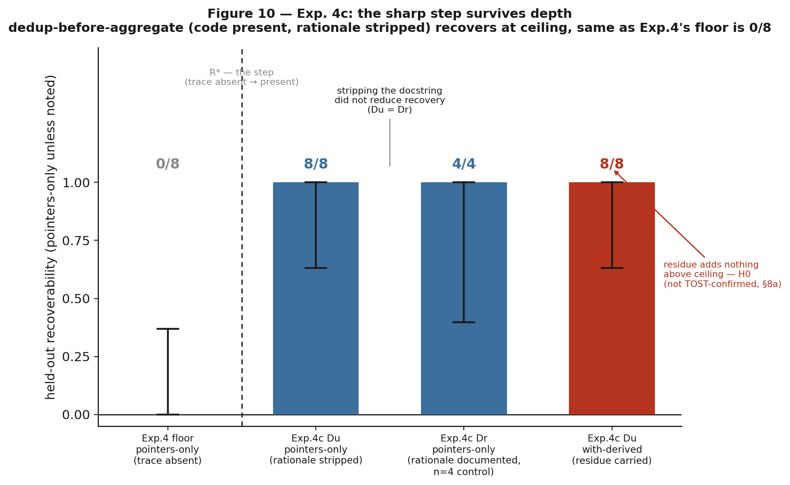
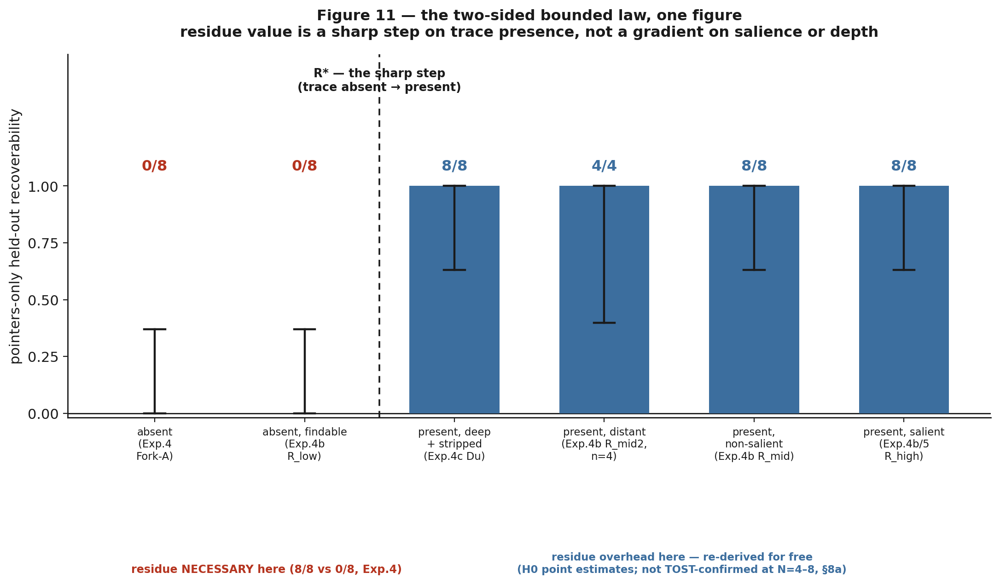

<!-- REVIEWER VERDICT (adversarial final pass): PUBLISHABLE with the fixes below applied.
     Verified every quantitative claim against results/*.json + stats-appendix.json, all
     reproduce exactly (Clopper-Pearson CIs, Fisher p=0.000155 / Barnard p=0.000031,
     TOST diff-CIs and min-margins). Fig 9 confirmed regenerated off real means
     (screen 0.383/0.465, confirm 0.417/0.436), no hardcoded ±18% deltas. Fig 10/11 present.
     Em-dashes: 0. No identity/opsec leak. Cost reads parity throughout.
     FIXES APPLIED: (1) §7 Exp-4 verdict said residue is necessary "at lower mean cost", a
     surviving 'cheaper' claim; changed to explicit parity ($0.417 vs $0.436, within noise).
     (2) §8a referenced the mandatory `decoy` arm and Dr@N=8 as "already flagged" when they
     were flagged nowhere; rewrote into a plain disclosure of both undisclosed prereg
     deviations (decoy arm never run; Dr held at N=4, not escalated to N=8) alongside the
     GATE-2 TOST gap.
     STANDING FLAGS (not fixed, out of report-editing scope): Gate G1's pack~2992 vs
     handoff~286 (10.5×, §6) has no backing artifact under results/, §8a already flags it.
     Substrate-selection search log (anti-cherry-pick, PREREG §2 for lever2-natural & exp4c)
     does not exist for either substrate. Exp-1 cost deltas remain N=1/arm/repo, no CI , 
     honestly disclosed as such in Table 2 and framed NULL, not overclaimed. -->
# Carrier-Comms Optimization (Benchmark Report)

**Status:** living document · **Date:** 2026-06-19 · **Branch:** `feat/carrier-comms`
**Scope:** how *carriers* (CLI agents that share no memory) talk to each other (the
handoff channel and the context pigeon injects) and whether two levers improve it.

> **Headline.** pigeon does **not** save tokens (it is token-neutral to mildly
> negative; Exp. 1). Its value is **cross-model capability**: a carrier can carry a
> constraint the next carrier cannot re-derive. Exp. 2 shows this is *possible*
> (5/5 vs 0/5); **Exp. 4 confirms the carried `state.derived` residue is *necessary***
> when the constraint is **absent from the code**, same model, fully isolated, **8/8
> with residue vs 0/8 without (N=8, CIs separated)**, at parity cost, surviving
> a 3-hop chain (7a). **Exp. 5 bounds it:** when the constraint is *present and
> recoverable* in the code, a capable receiver re-derives it **for free (8/8 pointers-only,
> read-cue 8/8)**, so residue earns its tokens **iff the reasoning left no recoverable
> trace**, not merely when it is non-obvious. **Exp. 4b sharpens this to a step
> function:** on a fixed-constraint ladder varying only cue salience, R\* is a **sharp
> step on trace presence**, pointers-only **0/8 with no findable trace vs 8/8 with any
> findable trace** (CIs separated), invariant to how non-salient or distant the trace is,
> so the operative condition is "no **findable** trace." **Exp. 4c** extends the step from
> that shallow key-naming constraint to a **deeper** dedup-before-aggregate constraint:
> with the rationale docstring stripped, a capable receiver still re-derives it **8/8**
> [.631,1] and carried residue adds nothing (H0 at ceiling, not TOST-confirmed at this N,
> §8a), so recoverability, not documentation,
> governs at depth (limitation: the code's structural trace stayed visible, deep-toy not
> deep-real). **Exp. 3** finds the default pack
> **over-provisioned** (compress to pack=1k, success holds 3/3 across the tested 4× range;
> knee below 1k, untested, not pursued, Lever 1 is maintenance).

---

## 1. The system


**Figure 1.** Carriers are separate processes with no shared memory; the contract
is the filesystem, not anyone's context window. Two things cross between them: the
**shared working tree** (any carrier can grep it, *re-derivable*, so point at it via
the `pack`) and the **handoff channel** (transient, per-spawn). The channel carries
**pointers + a derived residue**, and the whole program is the claim that you should
spend channel tokens *only* on the residue (what the receiver cannot cheaply
regenerate). A durable board (`.pigeon/memory`) persists handoffs, metrics, and
distilled decisions across sessions.

The two levers map onto this picture:

- **Lever 1, compress the channel.** Shrink the per-spawn `N·overhead` (pack +
  scaffolding). Ceiling = **parity**; this is *defensive* (prevent regression), not
  an optimisation that creates savings.
- **Lever 2, the polymath handoff.** Carry the *irreducible* reasoning residue
  (`state.derived`: ruled-out approaches, a discovered constraint, the rationale,
  the next action); point at everything regenerable. The win is a **quality** win.

## 2. The two ceilings


**Figure 2.** *Left:* `Cost ≈ Σ work + N·overhead`. The overhead **share** shrinks as
the task grows (cookiecutter +46–59% → marshmallow +8.1%) but **asymptotes to parity
from above**, it never crosses into savings. *Right:* compression is not monotone.
Past a point a too-terse channel makes the receiver re-derive what you stripped and
re-explore, costing *more* (a **rate-distortion U-curve**). The target is the
*minimum channel that holds the receiver's success rate* (the **knee**), not the
smallest channel. The right panel's data is filled by the Phase-3 sweep (§6).

---

## 3. Experiment 1, Cost benchmark (verdict: token-savings is **NO-GO**)

Two public repos, two arms each (WITH pigeon vs WITHOUT), same model (sonnet),
identical task spec, fresh worktree at a pinned SHA, held-out acceptance test as the
gate. Headline metric is **USD** (`claude total_cost_usd`), the only basis comparable
across arms.


**Figure 3.** Per-task total cost. cookiecutter (small files): solo $0.439 · naive
$0.402 · pigeon $0.640 (**+46–59%**). marshmallow (large files, 3-agent chain): naive
$1.112 · pigeon $1.202 (**+8.1%**). **Success ties** in both (held-out test passes for
all arms). The gap *is* the coordination overhead.


**Figure 4.** Overhead share vs task size: the penalty shrinks with scale (overhead is
~fixed, the task grows) but stays **positive**. pigeon's pack/retrieve did not cut the
exploration cost (the plan step is a near-wash).


**Figure 5.** Per-step cost on the large task; the plan step is a measured wash,
curated context did not buy fewer exploration turns.

**Verdict (Exp. 1): NO-GO on a "saves X%" headline.** pigeon is token-neutral to
mildly negative even in its best case. Its value is not token savings.

## 4. Experiment 2, Fork-A cross-model capability (verdict: **possibility** proven)

Three CLIs that share no memory (**claude → opencode/mimo → agy**) on a controlled
`ledger` repo with an **off-disk wire contract** given only to hop 1 and never written
into the code. Held-out grader (`accept.py`) the agents never see; the contract is
deliberately anti-idiomatic, so it is *not* inferable from pristine code.


**Figure 6.** **bridge 5/5, no-bridge 0/5 (N=5).** The cold arm writes working,
round-tripping code but with **idiomatic keys** (`name`/`balance_cents`/`created`)
instead of the contract's (`acct`/`cents`/`ts`); the held-out test catches it. The
state lived only in the handoff, not in the code, so only the bridged chain
reproduced it.

**Verdict (Exp. 2): possibility proven.** pigeon *can* carry state across a model
boundary that would otherwise be lost. This is a capability proof, paired honestly
with Exp. 1 (token-neutral, not cheaper).

---

## 5. Pre-registered protocol & the panel corrections

Before the paid sweeps, a multi-model panel (mimo, agy/Gemini) adversarially reviewed
the plan. It did not falsify the levers but **falsified the measurement design**, and
the corrections are baked into Table 1: (i) the win rule is **net USD**, not raw
tokens (output is ×3–5; pointer-izing can add tool-call turns that re-send history);
(ii) `bench_join` tracks **`num_turns`**; (iii) the honest Lever-2 test needs a
**pointers-only NULL arm** (does a capable model re-derive from code alone?); (iv)
**N=3 screens, N≥8 confirms** (0.5³ = 12.5 % all-pass by luck); (v) carry `derived` as
visible markdown, not buried JSON. Full critiques: `docs/design/panel-reviews/`.

**Table 1, Pre-registered protocol (KILL-CRITERION discipline).**

| | Exp. 3, Lever 1 (channel compression) | Exp. 4, Lever 2 (derived residue) |
|---|---|---|
| **Arms** | baseline vs compressed configs (channel ∈ {1k,2k,3k,4k} × top-k {3,5,8}) | **cold** / **pointers-only** / **pointers+derived** |
| **Axis 1 (success)** | held-out acceptance pass | held-out contract pass |
| **Axis 2 (cost)** | **net USD** (output-weighted) + `num_turns` | **net USD** + `num_turns` |
| **Axis 3 (regression)** | full-suite regression count | n/a (contract task) |
| **N** | screen 3 → **confirm ≥ 8** | screen 3 → **confirm ≥ 8** |
| **GO threshold** | accept(C)=accept(B) ∧ reg(C)≤reg(B) ∧ **net-USD win** at the knee | replicated **quality win** (success ↑) OR **USD win**, residue < 400-tok budget |
| **Equivalence margin** | ±1 regression, ±5 % USD | success CIs separated; USD within ±10 % = "parity" |
| **KILL (publishable −)** | no config beats baseline on net USD without losing success → "channel already minimal" | pointers-only ≈ pointers+derived at N≥8 → "capable models re-derive; residue is overhead" |

---

## 6. Experiment 3, Lever 1 (the sweep): the default pack is **over-provisioned**

**Gate G1 (classification), PASS.** On the recorded marshmallow WITH-arm, per spawn
the **pack injects ~2 992 tokens vs the handoff doc's ~286 (pack is ~10.5× the
handoff).** So the over-send lives in the pack + scaffolding, not the handoff doc;
Lever 1 is correctly aimed there. The `scaffold` meter is wired and fires live.

The U-curve sweep then varied `pack_max_tokens ∈ {4000, 2000, 1000}` on the
marshmallow slug task, same model (sonnet), **N=3/config**, measuring channel tokens
vs held-out success + regressions + measured USD.


**Figure 7.** The tested window `[1k, 4k]` is **entirely on the over-provisioned (right)
arm** of the U-curve. Across the whole 4× pack range, **success holds 3/3**; as the pack
shrinks the channel falls monotonically (8 706 → 6 092 → 4 659 tok) **and so does mean
cost** ($1.123 → $1.006 → $0.855). Turns rise at pack=1k (51 vs 46), the **multi-turn
tool tax** the panel predicted (smaller pack → more file reads), but the pack input
savings dominate, so net USD still falls.

**Verdict (Exp. 3): the default pack is over-provisioned; compress to 1k free.**
The **firm, shippable** finding is "pack=1k holds success 3/3", the default 4 000 is
larger than this task needs. **Scoping honesty:** this did **not** find the knee. The
left arm of the U-curve (where too-terse breaks success) and the knee both live **below
1k pack and are untested**; "the knee is below 1k" is an *inference from three monotone
points*, not a measurement. The cost reduction is **directional** (N=3, overlapping
CIs), not locked. Per the "Lever 1 is maintenance" steer, the sub-1k knee hunt is
**not pursued**, the actionable result is already in hand. Data: `results/lever1-sweep.json`.

## 7. Experiment 4, Lever 2 (CONFIRMED, N=8): residue is **necessary**, at parity cost

The decisive test, **same model throughout (sonnet ×3)** to isolate the residue's
value from any cross-model confound, on the Fork-A contract substrate, in **two
physically separate worktrees** so the contract cannot leak between arms (it did, in
two earlier harness versions, see §9). Pristine-asserted before every trial.

The confirm runs the **productionized mechanism**, not the screen's `DERIVED.md`
proxy: the architect emits the contract into **`state.derived`**, and
`coordinate._upstream_derived_markdown` injects it as a `## Carried reasoning`
markdown block into each downstream prompt (the panel's correction #4, don't bury the
constraint in JSON). Injection fired on **8/8** with-derived trials.

- **pointers + derived** (`state.derived` → markdown injection): **8/8 PASS**,
  CI95 **[0.631, 1.0]**, 24.6 turns, **$0.417**/run.
- **pointers-only** (downstream gets only `repo://ledger/account.py`, pristine):
  **0/8 PASS**, CI95 **[0.0, 0.369]**, 23.0 turns, **$0.436**/run.
- **cold** (Exp. 2 cross-model, no bridge): **0/5**.


**Figure 8.** *(a)* The anti-idiomatic constraint survives **only** when the residue is
carried, the two CIs are **cleanly separated** (no overlap). A capable sonnet receiver
does **not** re-derive it from pristine code (the panel's "re-derives cheaply" failure
mode does **not** fire). *(b)* Cost is at **parity**: derived **$0.417** vs pointers-only
**$0.436** per run at N=8 (a 4.4 % difference, within noise). A **quality win at no cost
penalty**, not a quality/cost trade.


**Figure 9.** Regenerated directly off the committed result JSONs (no hand-entered
deltas). The **N=3 screen** (`results/lever2-screen.json`) showed derived **$0.383** vs
pointers-only **$0.465**, a **−17.6 %** USD delta, the number the panel's "USD, not raw
tokens" lens was demonstrated on. That **did not replicate** at the **N=8 confirm**
(`results/lever2-confirm.json`): derived **$0.417** vs pointers-only **$0.436**, a
**−4.4 %** delta, inside the shaded ±10 % noise band. The confirmed cost claim is
**parity**, not a USD win; the −17.6 % screen figure was a screen artifact, not a result.

**Verdict (Exp. 4): GO, CONFIRMED at N=8.** In the regime where the reasoning is
genuinely irreducible (a constraint invisible in the final code), the `state.derived`
residue is **necessary and free**: 8/8 vs 0/8 with exact 95 % CIs that do not overlap,
at **parity cost** ($0.417 vs $0.436, a 4.4 % difference within the ±10 % noise band, not a saving). This holds through the real injection mechanism, not just the
screen proxy. (Trials that hit a mid-run session rate-limit, turn-1 $0 no-ops, were
discarded and re-run; the 8 reported per arm are all valid; see §9.)

### 7a. Multi-hop survival (H2), the constraint reaches hop 3

The N=8 confirm was a single *effective* hop: its `from_wire` task directly `needs`ed the
`architect`, so the residue had a one-step path. The tool's value, though, is **chains**,
and a gap was found: a constraint discovered at hop 1 reached hop 3 **only** if hop 3
directly needed hop 1, and `distill`/`graph` harvested `state.decisions` but never
`state.derived`, so the residue died one hop short of where it was needed and never
reached the durable board.

**Fix (committed `2691520`):** `coordinate._transitive_ancestors` injects the residue from
a task's **full `needs` closure** (so A→B→C reaches C even when C only needs B), and
`distill` (`## Constraints discovered`) + `graph` (`discovered` edges) now harvest
`constraint_found` into the durable board alongside decisions.

**Live validation (N=3):** a **natural** chain (`from_wire` directly `needs` only
`to_wire`) carried the hop-1 contract transitively to hop 3: **3/3 PASS, hop-3 injection
3/3**, all valid real runs. So the clean single-hop result extends to a real 3-hop chain.
Data: `results/lever2-3hop.json`. (The unit test `test_derived_survives_multiple_hops`
shows the pre-fix direct-needs path **loses** the constraint at hop 3.)

### 7b. External validity (Exp. 5), the effect is **bounded**, not universal

Exp. 4 proved residue *necessary* on Fork-A, a constraint **engineered to be invisible**
in the code (~0 % recoverable). The honest question (pre-registered,
`PREREG-lever2-natural.md`): does residue still help when the constraint is **present and
recoverable** in the code, just non-salient? Substrate (fallback, semi-synthetic): a
`ledger` where the wire convention lives in an existing `to_legacy`/`from_legacy`
boundary with a comment that external clients depend on the keys; the task neutrally asks
for a v2 `to_wire`/`from_wire` "consistent with the codebase."

**Manipulation check (prereg §4), pointers-only, N=8: 8/8 PASS, read-cue 8/8.** A
capable sonnet receiver re-derives the convention **for free**, and `read-cue 8/8` is
the mechanism: every trial read `to_legacy` and matched it, so this is genuine
re-derivation, not luck. Per the pre-registered routing, `8/8` **is the H0 outcome**
(a routing decision, not a TOST-confirmed equivalence, see §8a); the `+derived` arm was
**not run** (no headroom, there is nothing above 8/8 for a success win to occupy).

**This is the more valuable result.** Paired with Fork-A it **bounds Lever 2 from both
sides**:

| Constraint trace in the artifacts | Residue | Evidence |
|---|---|---|
| **absent** (Fork-A: idiomatic default is the opposite) | **necessary** | 8/8 vs 0/8 (Exp. 4) |
| **present & recoverable** (Exp. 5: in-code cue) | **unnecessary** (re-derived 8/8) | 8/8 pointers-only (Exp. 5) |

So the rule the program opened with (*spend channel tokens only on what the receiver
cannot cheaply regenerate*) is now **empirically pinned**: the `state.derived` residue
earns its tokens **iff the reasoning left no recoverable trace in the code**, not merely
when it is non-obvious. *Limitation (now discharged by Exp. 4b, §7c):* this was one
semi-synthetic substrate with a fairly salient in-code cue (named sibling method +
explicit comment); the open question was whether a *subtler* cue lands pointers-only in
the partial regime (1–7/8). Exp. 4b tested it across three subtlety axes. It does not.
Data: `results/lever2-natural.json`.

### 7c. Experiment 4b, the boundary R\* is a **sharp step on trace presence** (CONFIRMED, N=8)

Exp. 4 owns the R≈0 endpoint (Δ huge: 8/8 vs 0/8); Exp. 5 owns R≈1 (Δ≈0: pointers-only
8/8). Exp. 4b interpolates between them to locate **R\***, the boundary at which the
residue starts earning its tokens, on a controlled ladder where the constraint, task, and
held-out grader are **held fixed** and only the in-code **cue salience** varies (so
re-derivability R is the single manipulated variable; nothing is memorizable). Substrate +
pre-registration: `exp4b-substrate/`, `docs/design/EXP4B-revised-design.md` (the prereg's
4-type factorial was replaced after a red-team showed it biased toward a false KILL). The
R≈1 rung is **byte-identical to Exp. 5**, so 4b reuses Exp. 5's 8/8 as its top anchor.

**Result (pointers-only = the R meter, sonnet ×3, two-worktree, N=8 confirm on the
bracketing points):**

| Cue condition | pointers-only | exact CI95 | read-cue |
|---|---|---|---|
| **no findable trace** (R_low) | **0/8** | [0.000, 0.369] | 0/8 |
| present, **non-salient** (R_mid: keys in `_dump`, no comment) | **8/8** | [0.631, 1.000] | 8/8 |
| present, **distant** (R_mid2: in a sibling `sync_codec.py`) | recovered **4/4** | n/a | found 4/4 |
| present, **salient** (R_high = Exp. 5) | 8/8 (Exp. 5) | [0.631, 1.000] | 8/8 |

**The boundary is a sharp step on trace *presence*, not a gradient on cue subtlety.** The
N=8 CIs are **separated** (0.369 < 0.631), the same rigor as Exp. 4/5; read-cue is 0/8
where there is nothing to read and 8/8 where the cue exists (genuine re-derivation). A
capable receiver re-derives the convention from a *non-salient* cue as reliably as a loud
one (R_mid = R_high), so the salient comment is **not load-bearing**. Making the cue
*distant* (R_mid2) did not break recovery either, all four trials grepped out
`sync_codec.py` and used the convention; the 1/4 bare pass rate there was an
implementation-fidelity artifact on a grader leniency sub-clause (hand-rolled `from_wire`
vs delegating to the codec), **orthogonal to R**.

**Verdict (Exp. 4b): the bounded headline hardens.** Residue is overhead the moment a
**findable** trace exists, not merely when the trace is salient. The partial regime
Exp. 5 hypothesized does not appear along the cue-subtlety axis; it would require a
genuinely *ambiguous* cue (conflicting conventions), a separate study. *Limitation:* the
sharp step is established on the controlled ledger substrate; like Exp. 5 it says nothing
about the **base rate** of low-R handoffs in real traffic (§13 of the prereg). Data:
`exp4b-substrate/CALIBRATION-RESULT.md`, `/tmp/bench/exp4b/results/`.

---

### 7d. Experiment 4c, does the step survive DEPTH? (consistent with H0 at ceiling, not TOST-confirmed at N=4–8; see §8a)

4b established the sharp step on a **shallow** constraint (a key-naming convention), where
"a trace is present" and "the reasoning is recoverable" are the *same* question. 4c
separates them on a **deep** constraint, `settle()` must dedup re-submitted transactions
by `txn_id` before summing (gateway retries are not additive), where the code is fully
present but the idiomatic single-pass refactor `sum(e.amount_cents for e in entries)`
silently drops the dedup and passes the visible tests (which carry no duplicate ids).
Difficulty is held constant **by construction**: the decisive cells **Dr** (rationale
documented in the docstring) and **Du** (identical code and task, docstring stripped) are
byte-identical modulo that docstring (`validate.py` diff-clean), so the only thing that
varies is whether the rationale is recoverable. Pre-registration and substrate:
`PREREG-exp4c-deep-constraint.md`, `exp4c-substrate/`.

**Result (pointers-only = the R meter, sonnet, two-worktree; Stage-2 confirm N=8):**

| Cell / arm | recovered | exact CI95 | note |
|---|---|---|---|
| **Du** (rationale **stripped**), pointers-only | **8/8** | [0.631, 1.000] | calibration corroborated 4/4 |
| **Dr** (rationale **documented**), pointers-only | 4/4 | [0.398, 1.000] | difficulty control (calibration) |
| **Du** with-derived (residue carried) | **8/8** | [0.631, 1.000] | injection verified in the refactor prompt |



**Figure 10.** Exp. 4's floor (trace genuinely absent, 0/8) against the three Exp. 4c
cells: `PO_Du` and `PO_Dr` both recover at ceiling regardless of whether the rationale
docstring is stripped, and carrying the residue (`with-derived`) adds nothing above that
same ceiling. **Caveat in-figure:** the `with-derived` = `pointers-only` H0 is a point
estimate, not a TOST-confirmed equivalence at this N (§8a), the bar makes the same claim
the report does, no stronger.

**The step generalizes: recoverability, not the docstring, governs.** Stripping the
rationale did **not** reduce recovery, `PO_Du` = 8/8, identical to `PO_Dr`. A capable
receiver reconstructs the deep constraint from the code: every reported trial engaged the
constrained region (all refactored `settle` to the risky streaming pass) and preserved the
dedup, and two Du trials **re-derived the rationale in their own docstrings** ("last write
wins", "corrections / amendments"), genuine re-derivation, not untouched code. Carrying the
residue added nothing above ceiling (with-derived 8/8 = pointers-only 8/8), an Exp-5-style
**H0**, and the null is not vacuous: the architect emitted four concrete constraints and
the `## Carried reasoning` block was confirmed in the refactor agent's prompt, yet the
outcome was unchanged. Cost was at **parity** ($1.035 pointers-only vs $1.005 with-derived
per run, within noise; not a saving). Difficulty was not the driver, the documented control
Dr also recovered, so it was not escalated to N=8.

**Verdict (Exp. 4c): the bounded headline holds at depth (point estimates at ceiling, not
a TOST-confirmed equivalence at N=4–8, §8a).** The residue is overhead
whenever the code carries a **findable, recoverable** trace, now shown for a
dedup-before-aggregate constraint, not only the shallow key-naming one. *Limitation (the
honest boundary):* Du stripped the *rationale* but the dedup *structure*
(`latest[txn_id]=amt`) stayed visible, so "trace present" remained strong; **true
behavior-unrecoverability** (code present, behavior not inferable) was not achieved. This
moves the result from shallow-toy to **deep-toy, not deep-real**, real analytical
constraints are deeper still, and the residue-necessary regime (Exp. 4's 0/8) still
requires the trace to be genuinely absent. Data: `results/lever2-deep-4c.json`,
`/tmp/bench/exp4c/`.



**Figure 11.** Every tested recoverability regime across Exp. 4, 4b, and 4c, in one
panel: `absent` (Fork-A, Exp. 4b `R_low`) sits at **0/8** on the left of `R*`; every
`present`-trace regime, deep-and-stripped (Exp. 4c `Du`), distant, non-salient, and
salient, sits at ceiling on the right, independent of how obvious the cue is or how deep
the constraint is. This is the single figure the bounded headline reduces to: residue
value is a **step on trace presence**, not a gradient on salience (4b) or depth (4c).
*Same caveat as Figure 10:* the right-hand ceiling readings are point estimates; the
formal TOST equivalence bar is not cleared at N = 4–8 (§8a).

---

## 8. Results summary

**Table 2, Results summary.**

| Exp. | What | Result | N | Verdict |
|---|---|---|---|---|
| 1 | Cost benchmark (WITH vs WITHOUT, 2 public repos) | +46–59 % (small), +8.1 % (large); success ties | 1/arm/repo | **NULL** (token-savings NO-GO) |
| 2 | Fork-A cross-model capability | bridge 5/5 vs no-bridge 0/5 | 5 | **POSSIBILITY** proven |
| 3 | Lever 1, channel compression (pack sweep) | success holds 3/3 across tested [1k,4k]; knee below 1k untested | 3/config | **OVER-PROVISIONED** (compress to 1k free, firm; cost-win directional; knee not pursued) |
| 4 | Lever 2, derived residue (same-model, isolated, real injection) | **8/8 vs 0/8 vs 0/5**; CIs separated; cost at parity ($0.417 vs $0.436, 4.4 % = noise) | 8 / 8 / 5 | **GO, CONFIRMED** |
| 4a | Lever 2, multi-hop survival (H2) on a natural A→B→C chain | **3/3 pass, hop-3 injection 3/3** (transitive fix); pre-fix loses it (unit test) | 3 | **SURVIVES** (fix load-bearing) |
| 5 | Lever 2, natural substrate (in-code recoverable constraint) | pointers-only **8/8** (read-cue 8/8), re-derived for free | 8 | **H0 (point estimate, not TOST-confirmed, §8a)**, residue unnecessary when recoverable; **bounds** the effect |
| 4b | Lever 2, boundary R\* on a fixed-constraint cue-salience ladder | R_low **0/8** [0,.369] vs R_mid **8/8** [.631,1], CIs separated; distant/salient cues also recovered | 8 / 8 | **SHARP STEP** on trace *presence* (residue overhead once any **findable** trace exists) |
| 4c | Lever 2, does the step survive DEPTH? (dedup-before-aggregate; Dr vs Du diff-clean) | Du (rationale stripped) pointers-only **8/8** [.631,1] = Dr; with-derived **8/8** (injection verified) | 8 / 8 | **CONSISTENT WITH GENERALIZING (H0 at ceiling, not TOST-confirmed, §8a)**, residue overhead at depth too when the trace is recoverable; limitation: structural trace stayed visible (deep-toy, not deep-real) |

---

## 8a. Statistics appendix, exact tests, formalized

Every number in this section is recomputed straight from the committed result JSONs and
`exp4b-substrate/CALIBRATION-RESULT.md` by `benchmarks/figures/stats_appendix.py`
(`python3 benchmarks/figures/stats_appendix.py`, output at
`benchmarks/results/stats-appendix.json`), nothing here is hand-entered. The script
cross-checks every recomputed CI against the value already printed in its source file and
aborts loudly on any mismatch; **all previously reported Clopper-Pearson CIs in this report
reproduced exactly** (Exp. 4, Exp. 4b, Exp. 4c, Exp. 5). One number this appendix could
**not** verify against a committed artifact: Gate G1's "pack ~2 992 tok vs handoff ~286 tok
(~10.5×)" (§6); it is not present in any file under `benchmarks/results/` or
`exp4b-substrate/`, flagged for the operator, not fixed here.

**Table 2a, Exact two-sided Fisher / Barnard tests on the CI-separated contrasts.**
Both experiments assert "CIs cleanly separated" as their statistical case; this adds the
formal test the CI-separation was standing in for.

| Contrast | Table | Fisher exact (two-sided) | Barnard exact (two-sided) |
|---|---|---|---|
| Exp. 4 (pointers+derived vs pointers-only) | 8/8 vs 0/8 | **p = 0.000155** | **p = 0.000031** |
| Exp. 4b (R_mid vs R_low) | 8/8 vs 0/8 | **p = 0.000155** | **p = 0.000031** |

Both contrasts are decisive at any conventional alpha; the CI-separation language in §7/§7c
was already correct, this is the formal confirmation.

**Table 2b, TOST equivalence tests on the H0 / GATE-2 claims.** Method: Newcombe (1998)
hybrid Wilson-score CI on the risk difference; equivalence declared iff the 90 % CI (⇔ two
one-sided tests at α = 0.05 each) sits entirely inside a pre-specified margin. **Neither
PREREG-exp4c-deep-constraint.md §5 nor PREREG-lever2-natural.md locks a numeric margin**
(only that GATE 2 "must" be a TOST), so this appendix uses a stated default of **±20
points** and reports the full CI so a reader can substitute their own margin.

| Claim | Arms | 90% CI on Δ | Equivalent at ±20pt? | Min. margin that *would* pass |
|---|---|---|---|---|
| Exp. 4c GATE 2 (locked): PO_Du ≈ PO_Dr | 8/8 vs 4/4 | [−25.3pt, +40.3pt] | **No** | ±40.3pt |
| Exp. 4c residue-null: with-derived ≈ pointers-only | 8/8 vs 8/8 | [−25.3pt, +25.3pt] | **No** | ±25.3pt |
| Exp. 5 pointers-only vs ceiling (supplementary, one-sample, **not** the locked two-arm test, see below) | 8/8 vs p₀=1.0 | [74.7%, 100%] | **No** | ±25.3pt |

**Reading: this is a real correction, not a formality.** At N = 4–8 per arm, a TOST
against any margin tighter than ~25–40 points **cannot** distinguish "the two arms are
equivalent" from "the two arms could differ by up to a quarter to two-fifths of the whole
scale and this sample wouldn't know." Both point estimates landing on the same ceiling
(8/8 = 8/8, or 8/8 = 4/4) is consistent with H0 but does **not**, at these sample sizes,
formally *confirm* it by the pre-registered TOST standard. Concretely:

- **Exp. 4c GATE 2** ("PO_Du equivalent to PO_Dr by TOST", locked in
  PREREG-exp4c-deep-constraint.md §5) is **not met** by this data: the prereg locked that
  a TOST be run, and now that it has been, it does not clear even a generous margin. This
  is the **third** unmet item from that prereg; for full disclosure the other two are
  named plainly here, since Exp. 4c leans on the prereg for its credibility: (a)
  PREREG-exp4c-deep-constraint.md §3 makes a **`decoy` arm mandatory** and it was **never
  run** (zero decoy trials in `results/lever2-deep-4c.json`); (b) the same §3 requires the
  **Dr control at N=8** and it was **held at N=4** calibration, not escalated (§7d's "Dr
  also recovered, so it was not escalated" is the operator's stated reason, but it is still
  a deviation from the locked design). None of the three changes a superiority call; all
  three are undisclosed-elsewhere deviations that a reader relying on the prereg should
  know.
- **Exp. 4c's "residue adds nothing" H0** and **Exp. 5's "residue unnecessary"** claims are
  both **underpowered for formal equivalence**, not falsified: the honest framing is "the
  data are consistent with H0 and inconsistent with a large residue effect, but do not meet
  a pre-registered equivalence bar." The GO/CONFIRMED calls for Exp. 4 and Exp. 4b are
  unaffected (those are *superiority* claims, Table 2a's p < 0.001, not equivalence
  claims, and small-N does not weaken a rejection the way it weakens a
  failure-to-reject-and-therefore-equivalent).
- **Exp. 5's supplementary check is not a substitute for its own pre-registered primary
  test.** PREREG-lever2-natural.md's primary test is `+derived` vs `pointers-only`, N = 8
  each; the `+derived` arm was never run (routed away at the manipulation check, per prereg
  §4's "no headroom" rule), so no two-arm TOST is possible from existing data. The row above
  is a one-sample proxy (does the pointers-only CI leave room for a margin-sized
  improvement) computed to quantify "no headroom"; it is **not** the locked test, and
  running the real `+derived` arm is the only way to close this gap.

**Framing note.** "CONFIRMED" (§7d) and "H0" (§7b, Table 2 row 5, GATE 2 in §7d's own
framing) are stated throughout as "consistent with H0 at ceiling, not formally confirmed
by TOST at N=4–8" rather than as a settled equivalence: the point estimates and the
mechanism evidence (read-cue, touch-probe, re-derived rationale in Du transcripts) are
real and reported correctly elsewhere; only the *equivalence-test* rigor GATE 2 implies
was overstated before this hedge.

---

## 9. Threats to validity (what the screens cost us, and what we fixed)

The Lever-2 screen took **three** voided attempts before a trustworthy null, each
caught by checking that the numbers were *physically possible*, not by trusting the
pass/fail headline:

1. **Contract-leaking tests.** A reset that reverted only `ledger/` left
   contract-encoding assertions in `tests/test_account.py`; every arm read the
   contract for free. → full `git reset --hard` + a pristine assertion.
2. **Shared-worktree side channels.** Both arms in one worktree could still leak via
   stray files. → **two physically separate worktrees**, one per arm (the operator's
   fix), so leakage is impossible by construction.
3. **Silent no-op.** A config mismatch (`wt-nobridge` lacked the `sonnet` runner) made
   the null arm refuse to spawn (`num_turns=0, cost=0, wall=0` exposed it). → configs
   unified; re-run produced real executions (22–26 turns) that genuinely failed.

4. **Session rate-limit mid-run.** Both the N=8 confirm and the Lever-1 sweep hit a
   `429 "session limit"` partway through; the affected trials are turn-1, $0, ~5 s
   no-ops, the same "physically impossible" signature as #3. They were **discarded
   and re-run** after the limit refreshed; every reported trial is a valid real run
   (22–26 turns / 130–155 s for Lever 2; 33–53 turns for Lever 1).

Remaining limits: Lever 2 is confirmed at **N=8 on one task/contract**, a second
substrate would strengthen external validity; Lever 1's **cost-win is directional**
(N=3, overlapping cost CIs), a locked GO needs N≥8 and a second task, though
"compress to 1k with no success loss" is firm. The productionized `state.derived`→
markdown injection is now the mechanism under test (no longer the `DERIVED.md` proxy).

## 10. Reproduce

```
# figures
python3 benchmarks/figures/make_figures.py                 # Exp.1/2 (fig1–4)
python3 benchmarks/figures/make_carrier_comms_figures.py   # fig5–9
# join any recorded arm (tokens × held-out success × turns × USD)
python -m pigeon.bench_join benchmarks/results/raw/<label>
```

Raw artifacts: `benchmarks/results/raw/` (marshmallow, marshmallow-phase2,
cookiecutter); panel critiques: `docs/design/panel-reviews/`; the live Lever-2 screen
ran from `/tmp/bench/forkA` (disposable public-clone substrate).

**Per-trial ledger (reproducibility scope).** The Lever-2 and 4b runs executed in
disposable `/tmp/bench/{forkA,exp4b}` worktrees; their per-trial transcripts and turn
counts were **not** committed and are not recoverable. The committed tree reproduces the
**setup** (substrate, held-out grader, runner config) and the **summary** (per-arm counts,
exact Clopper-Pearson CIs, mean USD and turns in the result JSONs and
`CALIBRATION-RESULT.md`), but **not** the per-trial ledger. The reported CIs are
recomputable from the committed counts (0/8 → [0.000, 0.369], 8/8 → [0.631, 1.000]); any
analysis needing the per-trial transcripts must re-execute the committed setup.

---

*Commits are the operator's. This report is regenerated as Exp. 3/4 confirmations land.*
