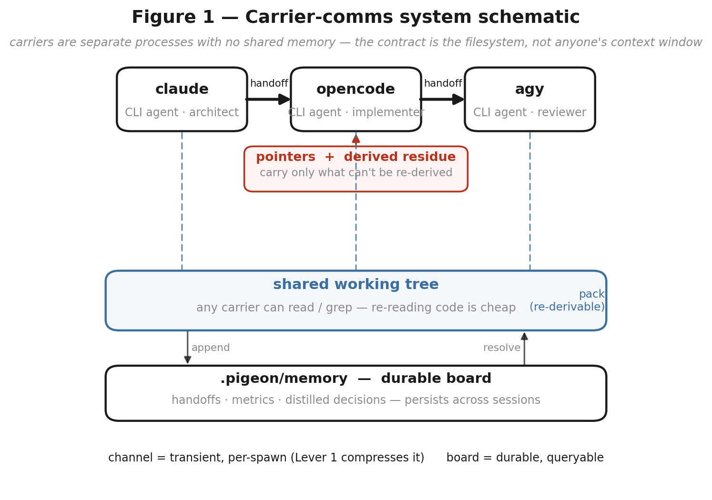
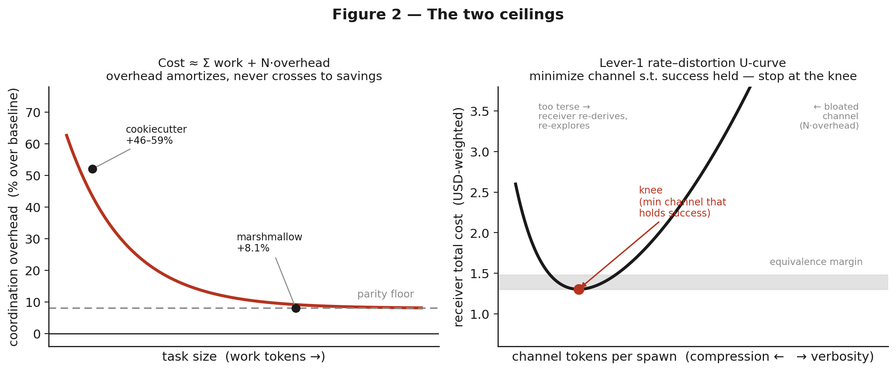
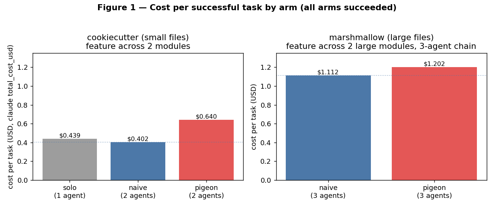
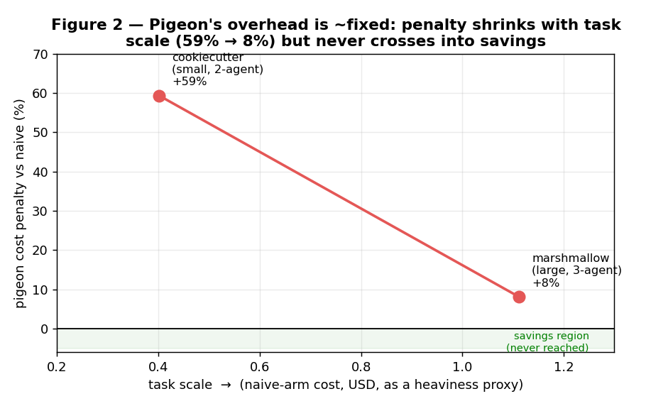
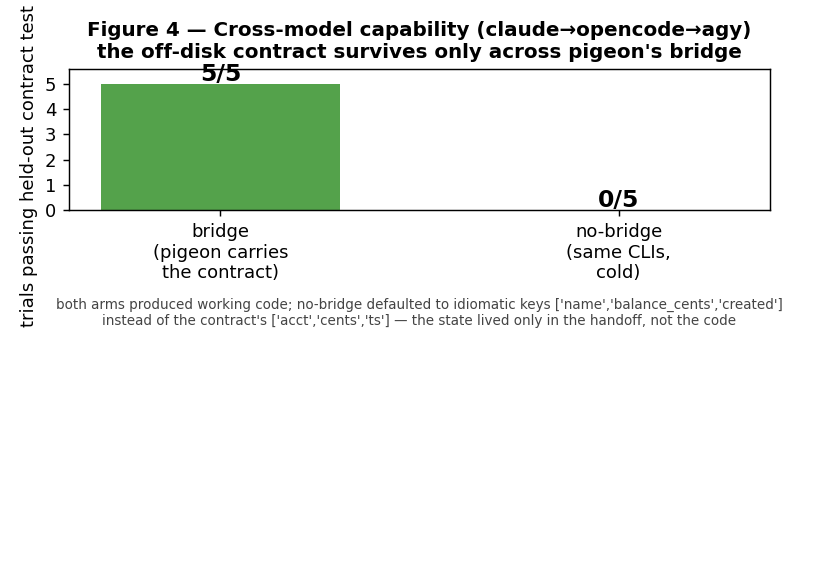
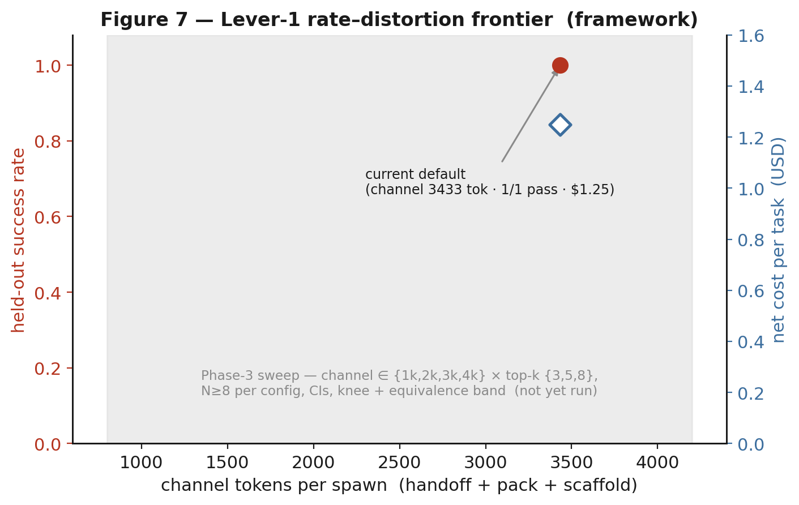
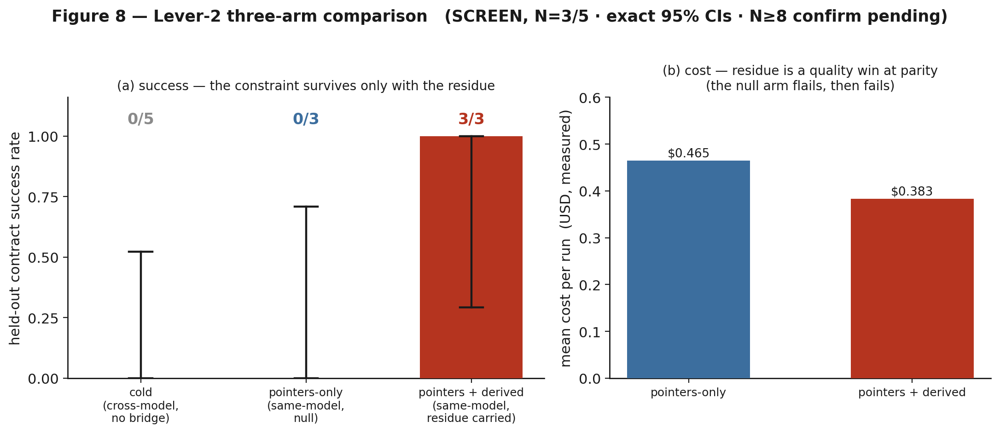
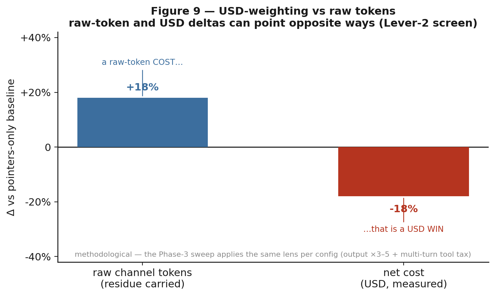

# Carrier-Comms Optimization — Benchmark Report

**Status:** living document · **Date:** 2026-06-19 · **Branch:** `feat/carrier-comms`
**Scope:** how *carriers* (CLI agents that share no memory) talk to each other — the
handoff channel and the context pigeon injects — and whether two levers improve it.

> **Headline.** pigeon does **not** save tokens (it is token-neutral to mildly
> negative; Exp. 1). Its value is **cross-model capability**: a carrier can carry a
> constraint the next carrier cannot re-derive. Exp. 2 shows this is *possible*
> (5/5 vs 0/5); Exp. 4 shows the carried **reasoning residue is *necessary*** in
> that regime — same model, fully isolated, **3/3 with residue vs 0/3 without** —
> at parity cost. Both Exp. 3/4 numbers below are **screens (N=3)**; the N≥8
> confirmation is pre-registered (Table 1) and pending.

---

## 1. The system



**Figure 1.** Carriers are separate processes with no shared memory; the contract
is the filesystem, not anyone's context window. Two things cross between them: the
**shared working tree** (any carrier can grep it — *re-derivable*, so point at it via
the `pack`) and the **handoff channel** (transient, per-spawn). The channel carries
**pointers + a derived residue** — and the whole program is the claim that you should
spend channel tokens *only* on the residue (what the receiver cannot cheaply
regenerate). A durable board (`.pigeon/memory`) persists handoffs, metrics, and
distilled decisions across sessions.

The two levers map onto this picture:

- **Lever 1 — compress the channel.** Shrink the per-spawn `N·overhead` (pack +
  scaffolding). Ceiling = **parity**; this is *defensive* (prevent regression), not
  an optimisation that creates savings.
- **Lever 2 — the polymath handoff.** Carry the *irreducible* reasoning residue
  (`state.derived`: ruled-out approaches, a discovered constraint, the rationale,
  the next action); point at everything regenerable. The win is a **quality** win.

## 2. The two ceilings



**Figure 2.** *Left:* `Cost ≈ Σ work + N·overhead`. The overhead **share** shrinks as
the task grows (cookiecutter +46–59% → marshmallow +8.1%) but **asymptotes to parity
from above** — it never crosses into savings. *Right:* compression is not monotone.
Past a point a too-terse channel makes the receiver re-derive what you stripped and
re-explore, costing *more* — a **rate–distortion U-curve**. The target is the
*minimum channel that holds the receiver's success rate* (the **knee**), not the
smallest channel. The right panel's data is filled by the Phase-3 sweep (§6).

---

## 3. Experiment 1 — Cost benchmark (verdict: token-savings is **NO-GO**)

Two public repos, two arms each (WITH pigeon vs WITHOUT), same model (sonnet),
identical task spec, fresh worktree at a pinned SHA, held-out acceptance test as the
gate. Headline metric is **USD** (`claude total_cost_usd`), the only basis comparable
across arms.



**Figure 3.** Per-task total cost. cookiecutter (small files): solo $0.439 · naive
$0.402 · pigeon $0.640 (**+46–59%**). marshmallow (large files, 3-agent chain): naive
$1.112 · pigeon $1.202 (**+8.1%**). **Success ties** in both (held-out test passes for
all arms). The gap *is* the coordination overhead.



**Figure 4.** Overhead share vs task size: the penalty shrinks with scale (overhead is
~fixed, the task grows) but stays **positive**. pigeon's pack/retrieve did not cut the
exploration cost (the plan step is a near-wash).


**Figure 5.** Per-step cost on the large task; the plan step is a measured wash —
curated context did not buy fewer exploration turns.

**Verdict (Exp. 1): NO-GO on a "saves X%" headline.** pigeon is token-neutral to
mildly negative even in its best case. Its value is not token savings.

## 4. Experiment 2 — Fork-A cross-model capability (verdict: **possibility** proven)

Three CLIs that share no memory — **claude → opencode/mimo → agy** — on a controlled
`ledger` repo with an **off-disk wire contract** given only to hop 1 and never written
into the code. Held-out grader (`accept.py`) the agents never see; the contract is
deliberately anti-idiomatic, so it is *not* inferable from pristine code.



**Figure 6.** **bridge 5/5, no-bridge 0/5 (N=5).** The cold arm writes working,
round-tripping code but with **idiomatic keys** (`name`/`balance_cents`/`created`)
instead of the contract's (`acct`/`cents`/`ts`); the held-out test catches it. The
state lived only in the handoff, not in the code — so only the bridged chain
reproduced it.

**Verdict (Exp. 2): possibility proven.** pigeon *can* carry state across a model
boundary that would otherwise be lost. This is a capability proof, paired honestly
with Exp. 1 (token-neutral, not cheaper).

---

## 5. Pre-registered protocol & the panel corrections

Before the paid sweeps, a multi-model panel (mimo, agy/Gemini) adversarially reviewed
the plan. It did not falsify the levers but **falsified the measurement design**, and
the corrections are baked into Table 1: (i) the win rule is **net USD**, not raw
tokens (output is ×3–5; pointer-izing can add tool-call turns that re-send history);
(ii) `bench_join` tracks **`num_turns`**; (iii) the honest Lever-2 test needs a
**pointers-only NULL arm** (does a capable model re-derive from code alone?); (iv)
**N=3 screens, N≥8 confirms** (0.5³ = 12.5 % all-pass by luck); (v) carry `derived` as
visible markdown, not buried JSON. Full critiques: `docs/design/panel-reviews/`.

**Table 1 — Pre-registered protocol (KILL-CRITERION discipline).**

| | Exp. 3 — Lever 1 (channel compression) | Exp. 4 — Lever 2 (derived residue) |
|---|---|---|
| **Arms** | baseline vs compressed configs (channel ∈ {1k,2k,3k,4k} × top-k {3,5,8}) | **cold** / **pointers-only** / **pointers+derived** |
| **Axis 1 (success)** | held-out acceptance pass | held-out contract pass |
| **Axis 2 (cost)** | **net USD** (output-weighted) + `num_turns` | **net USD** + `num_turns` |
| **Axis 3 (regression)** | full-suite regression count | n/a (contract task) |
| **N** | screen 3 → **confirm ≥ 8** | screen 3 → **confirm ≥ 8** |
| **GO threshold** | accept(C)=accept(B) ∧ reg(C)≤reg(B) ∧ **net-USD win** at the knee | replicated **quality win** (success ↑) OR **USD win**, residue < 400-tok budget |
| **Equivalence margin** | ±1 regression, ±5 % USD | success CIs separated; USD within ±10 % = "parity" |
| **KILL (publishable −)** | no config beats baseline on net USD without losing success → "channel already minimal" | pointers-only ≈ pointers+derived at N≥8 → "capable models re-derive; residue is overhead" |

---

## 6. Experiment 3 — Lever 1 (status: **framework; Phase-3 sweep pending**)

**Gate G1 (classification) — PASS.** On the recorded marshmallow WITH-arm, per spawn
the **pack injects ~2 992 tokens vs the handoff doc's ~286 — pack is ~10.5× the
handoff.** So the over-send lives in the pack + scaffolding, not the handoff doc;
Lever 1 is correctly aimed there. The `scaffold` meter is now wired and fires live
(confirmed on the Phase-2 run: 3 events/run).



**Figure 7.** The rate–distortion frame with the **one** config measured so far (the
current default: channel 3 433 tok, 1/1 pass, $1.25). The sweep that fills the
frontier and locates the knee is **pre-registered (Table 1) and not yet run** — by the
panel's own steer, Lever 1 is maintenance, so it is de-prioritised behind Lever 2.

**Verdict (Exp. 3): pending.** Expectation per Exp. 1: movement toward parity, never
savings — most likely a clean "channel already near-minimal" null.

## 7. Experiment 4 — Lever 2 (the result): residue is **necessary**, at parity cost

The decisive test, **same model throughout (sonnet ×3)** to isolate the residue's
value from any cross-model confound, on the Fork-A contract substrate, in **two
physically separate worktrees** so the contract cannot leak between arms (it did, in
two earlier harness versions — see §9). Pristine-asserted before every trial.

- **pointers + derived** (architect writes the contract to `DERIVED.md`; downstream
  receives it): **3/3 PASS**, 28.3 turns, **$0.383**/run.
- **pointers-only** (downstream gets only `repo://ledger/account.py`, pristine):
  **0/3 PASS**, 24.0 turns, **$0.465**/run.
- **cold** (Exp. 2 cross-model, no bridge): **0/5**.



**Figure 8.** *(a)* The anti-idiomatic constraint survives **only** when the residue is
carried — a capable sonnet receiver does **not** re-derive it from pristine code (the
panel's "re-derives cheaply" failure mode does **not** fire here). *(b)* The residue
arm is **cheaper**: the null agents explore more, then fail. So this is a **quality win
at parity-or-better cost**, not a quality/cost trade.



**Figure 9.** The methodological lens the panel demanded: carrying the residue is a
**+18 % raw-token cost** but a **−18 % net-USD outcome** — the two deltas point
opposite ways. A raw-token accounting would have mis-scored this.

**Verdict (Exp. 4): GO at screen level (N=3); confirm at N≥8 pending.** In the regime
where the reasoning is genuinely irreducible (a constraint invisible in the final
code), the `derived` residue is **necessary and free**. The exact 95 % CIs at N=3 are
wide (3/3 → [0.29, 1.0]; 0/3 → [0, 0.71]) — the point estimates are starkly separated,
but the pre-registered **N≥8** run is required before this is more than a strong screen.

---

## 8. Results summary

**Table 2 — Results summary.**

| Exp. | What | Result | N | Verdict |
|---|---|---|---|---|
| 1 | Cost benchmark (WITH vs WITHOUT, 2 public repos) | +46–59 % (small), +8.1 % (large); success ties | 1/arm/repo | **NULL** — token-savings NO-GO |
| 2 | Fork-A cross-model capability | bridge 5/5 vs no-bridge 0/5 | 5 | **POSSIBILITY** proven |
| 3 | Lever 1 — channel compression | G1: pack ≈10.5× handoff; sweep pending | — | **PENDING** (expect parity null) |
| 4 | Lever 2 — derived residue (same-model, isolated) | **3/3 vs 0/3 vs 0/5**; residue cheaper | 3 / 3 / 5 | **GO (screen)** — confirm N≥8 pending |

---

## 9. Threats to validity (what the screens cost us, and what we fixed)

The Lever-2 screen took **three** voided attempts before a trustworthy null — each
caught by checking that the numbers were *physically possible*, not by trusting the
pass/fail headline:

1. **Contract-leaking tests.** A reset that reverted only `ledger/` left
   contract-encoding assertions in `tests/test_account.py`; every arm read the
   contract for free. → full `git reset --hard` + a pristine assertion.
2. **Shared-worktree side channels.** Both arms in one worktree could still leak via
   stray files. → **two physically separate worktrees**, one per arm (the operator's
   fix), so leakage is impossible by construction.
3. **Silent no-op.** A config mismatch (`wt-nobridge` lacked the `sonnet` runner) made
   the null arm refuse to spawn — `num_turns=0, cost=0, wall=0` exposed it. → configs
   unified; re-run produced real executions (22–26 turns) that genuinely failed.

Remaining limits: **N=3** (screen only); the residue is delivered as a `DERIVED.md`
artifact pointer rather than the `state.derived`→auto-markdown injection (the panel's
correction #4 — that productionisation is the "scale" step, built only once the screen
showed signal); single task substrate (one contract). The N≥8 confirm + a second
substrate are the next runs.

## 10. Reproduce

```
# figures
python3 benchmarks/figures/make_figures.py                 # Exp.1/2 (fig1–4)
python3 benchmarks/figures/make_carrier_comms_figures.py   # fig5–9
# join any recorded arm (tokens × held-out success × turns × USD)
python -m pigeon.bench_join benchmarks/results/raw/<label>
```

Raw artifacts: `benchmarks/results/raw/` (marshmallow, marshmallow-phase2,
cookiecutter); panel critiques: `docs/design/panel-reviews/`; the live Lever-2 screen
ran from `/tmp/bench/forkA` (disposable public-clone substrate).

---

*Commits are the operator's. This report is regenerated as Exp. 3/4 confirmations land.*
