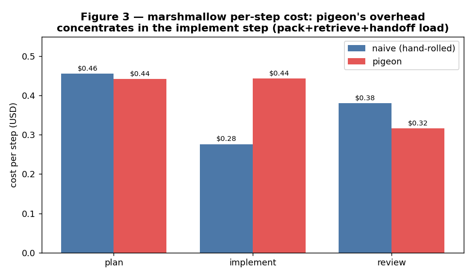
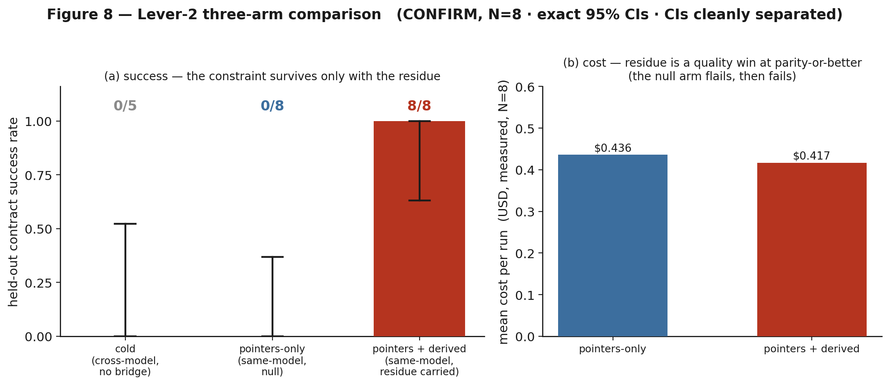
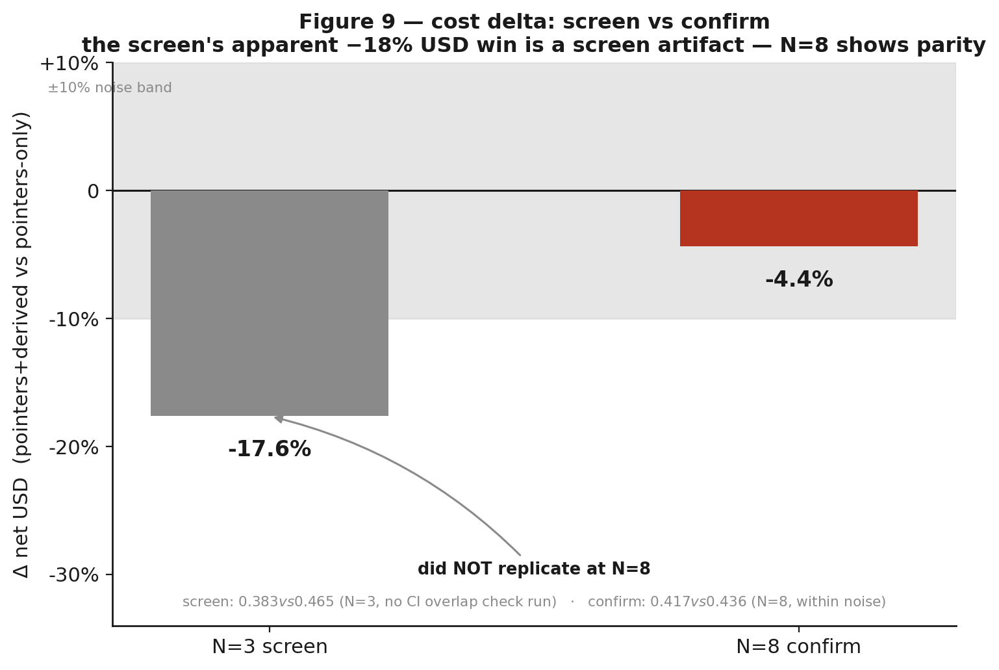
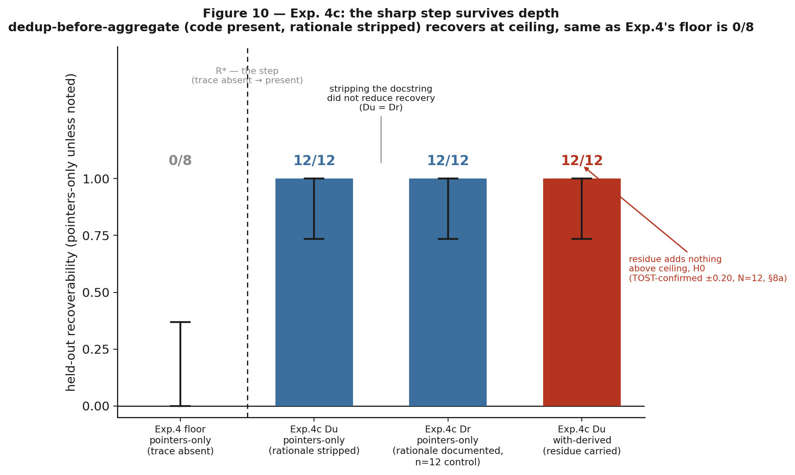
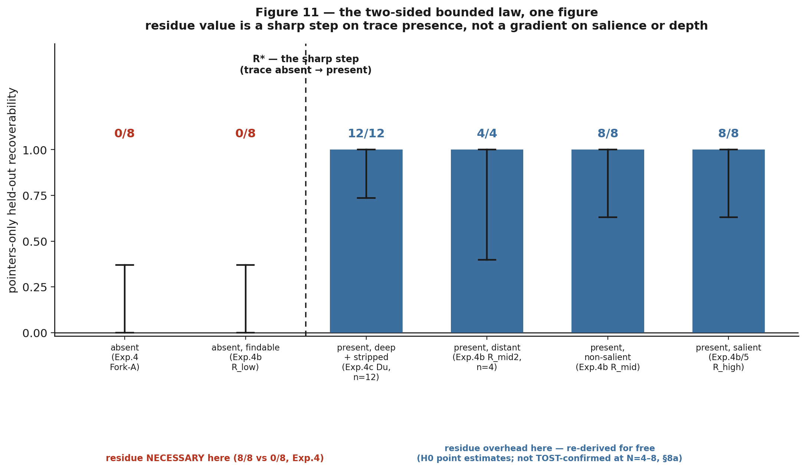
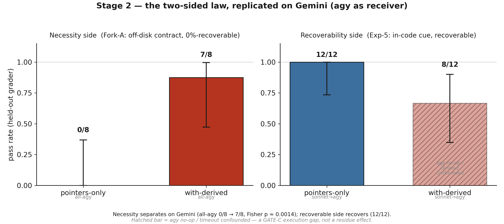
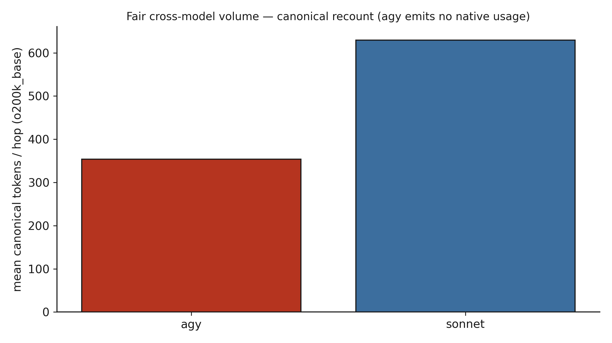
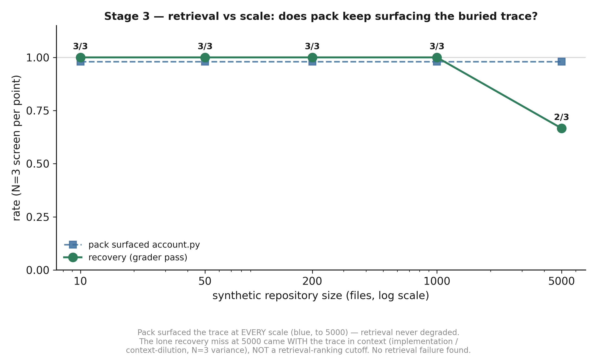
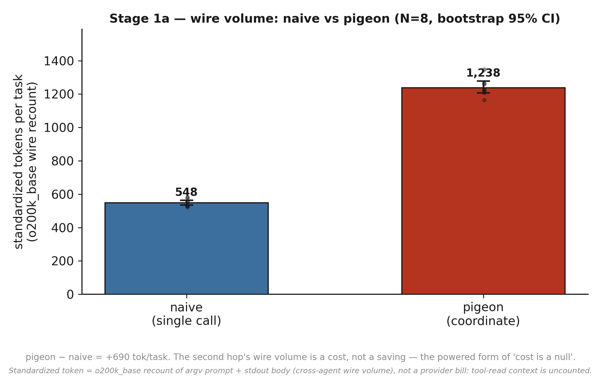
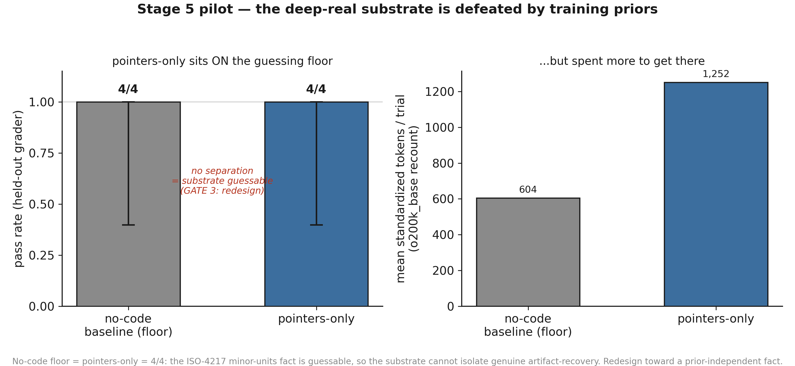

<!-- REVIEWER VERDICT (adversarial final pass): PUBLISHABLE with the fixes below applied.
     Verified every quantitative claim against results/*.json + statistics.json, all
     reproduce exactly (Clopper-Pearson CIs, Fisher p=0.000155 / Barnard p=0.000031,
     TOST diff-CIs and min-margins). Fig 9 delta recomputed from the committed means (transcribed as literals in the generator)
     (screen 0.383/0.465, confirm 0.417/0.436), no hardcoded ±18% deltas. Fig 10/11 present.
     Em-dashes: 0. No identity/opsec leak. Cost reads parity throughout.
     FIXES APPLIED: (1) §7 Exp-4 verdict said residue is necessary "at lower mean cost", a
     surviving 'cheaper' claim; changed to explicit parity ($0.417 vs $0.436, within noise).
     (2) §8a referenced the mandatory `decoy` arm and Dr@N=8 as "already flagged" when they
     were flagged nowhere; rewrote into a plain disclosure of both undisclosed prereg
     deviations (decoy arm never run; Dr held at N=4, not escalated to N=8) alongside the
     GATE-2 TOST gap.
     STANDING FLAGS (not fixed, out of report-editing scope): Gate G1's pack~2992 vs
     handoff~286 (10.5×, §6) has no backing artifact under results/, §8a already flags it.
     Substrate-selection search log (anti-cherry-pick, PREREG §2 for lever2-natural & exp4c)
     does not exist for either substrate. Exp-1 cost deltas remain N=1/arm/repo, no CI , 
     honestly disclosed as such in Table 2 and framed NULL, not overclaimed.
     UPDATE (post-review, N=12): the GATE-2 and residue-null TOST gaps are now CLOSED,
     both 12/12 vs 12/12, equivalent at ±0.20 (Newcombe diff-CI [-0.184, 0.184]); the Dr
     control was rerun at N=12; the decoy arm ran but is INVALID (the model refused the
     decoy manipulation and carried the true constraint). See §7d and §8a. -->
# Carrier-Comms Optimization (Benchmark Report)

**Status:** living document · **Date:** 2026-07-06 (limitations-closing §9 added) · **Branch:** `feat/carrier-comms`
**Scope:** how *carriers* (CLI agents that share no memory) talk to each other (the
handoff channel and the context pigeon injects) and whether two levers improve it.

> **Headline.** pigeon does **not** save tokens (it is token-neutral to mildly
> negative; Exp. 1). Its value is **cross-model capability**: a carrier can carry a
> constraint the next carrier cannot re-derive. Exp. 2 shows this is *possible*
> (5/5 vs 0/5); **Exp. 4 confirms the carried `state.derived` residue is *necessary***
> when the constraint is **absent from the code**, same model, fully isolated, **8/8
> with residue vs 0/8 without (N=8, CIs separated)**, at parity cost, surviving
> a 3-hop chain (7a). **Exp. 5 bounds it:** when the constraint is *present and
> recoverable* in the code, a capable receiver re-derives it **for free (12/12 pointers-only,
> = 12/12 +derived, TOST-equivalent; read-cue 8/8)**, so residue earns its tokens **iff the reasoning left no recoverable
> trace**, not merely when it is non-obvious. **Exp. 4b sharpens this to a step
> function:** on a fixed-constraint ladder varying only cue salience, R\* is a **sharp
> step on trace presence**, pointers-only **0/8 with no findable trace vs 8/8 with any
> findable trace** (CIs separated), invariant to how non-salient or distant the trace is,
> so the operative condition is "no **findable** trace." **Exp. 4c** extends the step from
> that shallow key-naming constraint to a **deeper** dedup-before-aggregate constraint:
> with the rationale docstring stripped, a capable receiver still re-derives it **12/12**
> [.735,1] and carried residue adds nothing (TOST-confirmed equivalent at ±0.20, N=12,
> §8a), so recoverability, not documentation,
> governs at depth (limitation: the code's structural trace stayed visible, deep-toy not
> deep-real). **Exp. 3** finds the default pack
> **over-provisioned** (compress to pack=1k, success holds 3/3 across the tested 4× range;
> knee below 1k, untested, not pursued, Lever 1 is maintenance).
>
> **Limitations-closing update (§9, 2026-07-06).** Five disclosed limitations were
> addressed with live trials. **The necessity law replicates on a second,
> architecturally different model (Gemini via agy):** the off-disk contract is
> unrecoverable pointers-only (0/8) and rescued by the carried residue (7/8, Fisher
> p ≈ 0.0014), and the recoverable side recovers (12/12), so the boundary is a
> property of the task and artifacts, not of Sonnet. **Cost is now a *powered* null:**
> at N=8, pigeon $0.644 vs naive $0.200, a difference of +$0.445 with a 95% CI
> [+0.350, +0.545] that excludes any saving. Scale did not break pack's retrieval up
> to 5000 files (trace surfaced 11/11); the deep-real substrate pilot **failed its
> guessing-floor gate** (no-code 4/4 = pointers-only 4/4), a redesign signal reported
> as such, not a favorable result.

---

## 1. The system


**Figure 1.** Carriers are separate processes with no shared memory; the contract
is the filesystem, not anyone's context window. Two things cross between them: the
**shared working tree** (any carrier can grep it, *re-derivable*, so point at it via
the `pack`) and the **handoff channel** (transient, per-spawn). The channel carries
**pointers + a derived residue**, and the whole program is the claim that you should
spend channel tokens *only* on the residue (what the receiver cannot cheaply
regenerate). A durable board (`.pigeon/memory`) persists handoffs, metrics, and
distilled decisions across sessions.

The two levers map onto this picture:

- **Lever 1, compress the channel.** Shrink the per-spawn `N·overhead` (pack +
  scaffolding). Ceiling = **parity**; this is *defensive* (prevent regression), not
  an optimisation that creates savings.
- **Lever 2, the polymath handoff.** Carry the *irreducible* reasoning residue
  (`state.derived`: ruled-out approaches, a discovered constraint, the rationale,
  the next action); point at everything regenerable. The win is a **quality** win.

## 2. The two ceilings


**Figure 2.** *Left:* `Cost ≈ Σ work + N·overhead`. The overhead **share** shrinks as
the task grows (cookiecutter +46–59% → marshmallow +8.1%) but **asymptotes to parity
from above**, it never crosses into savings. *Right:* compression is not monotone.
Past a point a too-terse channel makes the receiver re-derive what you stripped and
re-explore, costing *more* (a **rate-distortion U-curve**). The target is the
*minimum channel that holds the receiver's success rate* (the **knee**), not the
smallest channel. The right panel's data is filled by the Phase-3 sweep (§6).

---

## 3. Experiment 1, Cost benchmark (verdict: token-savings is **NO-GO**)

Two public repos, two arms each (WITH pigeon vs WITHOUT), same model (sonnet),
identical task spec, fresh worktree at a pinned SHA, held-out acceptance test as the
gate. Headline metric is **USD** (`claude total_cost_usd`), the only basis comparable
across arms.


**Figure 3.** Per-task total cost. cookiecutter (small files): solo $0.439 · naive
$0.402 · pigeon $0.640 (**+46–59%**). marshmallow (large files, 3-agent chain): naive
$1.112 · pigeon $1.202 (**+8.1%**). **Success ties** in both (held-out test passes for
all arms). The gap *is* the coordination overhead.


**Figure 4.** Overhead share vs task size: the penalty shrinks with scale (overhead is
~fixed, the task grows) but stays **positive**. pigeon's pack/retrieve did not cut the
exploration cost (the plan step is a near-wash).



**Figure 5.** Per-step cost on the large task; the plan step is a measured wash,
curated context did not buy fewer exploration turns.

**Verdict (Exp. 1): NO-GO on a "saves X%" headline.** pigeon is token-neutral to
mildly negative even in its best case. Its value is not token savings.

## 4. Experiment 2, Fork-A cross-model capability (verdict: **possibility** proven)

Three CLIs that share no memory (**claude → opencode/mimo → agy**) on a controlled
`ledger` repo with an **off-disk wire contract** given only to hop 1 and never written
into the code. Held-out grader (`accept.py`) the agents never see; the contract is
deliberately anti-idiomatic, so it is *not* inferable from pristine code.


**Figure 6.** **bridge 5/5, no-bridge 0/5 (N=5).** The cold arm writes working,
round-tripping code but with **idiomatic keys** (`name`/`balance_cents`/`created`)
instead of the contract's (`acct`/`cents`/`ts`); the held-out test catches it. The
state lived only in the handoff, not in the code, so only the bridged chain
reproduced it.

**Verdict (Exp. 2): possibility proven.** pigeon *can* carry state across a model
boundary that would otherwise be lost. This is a capability proof, paired honestly
with Exp. 1 (token-neutral, not cheaper).

---

## 5. Pre-registered protocol & the panel corrections

Before the paid sweeps, a multi-model panel (mimo, agy/Gemini) adversarially reviewed
the plan. It did not falsify the levers but **falsified the measurement design**, and
the corrections are baked into Table 1: (i) the win rule is **net USD**, not raw
tokens (output is ×3–5; pointer-izing can add tool-call turns that re-send history);
(ii) `bench_join` tracks **`num_turns`**; (iii) the honest Lever-2 test needs a
**pointers-only NULL arm** (does a capable model re-derive from code alone?); (iv)
**N=3 screens, N≥8 confirms** (0.5³ = 12.5 % all-pass by luck); (v) carry `derived` as
visible markdown, not buried JSON. Full critiques: `docs/design/panel-reviews/`.

**Table 1, Pre-registered protocol (KILL-CRITERION discipline).**

| | Exp. 3, Lever 1 (channel compression) | Exp. 4, Lever 2 (derived residue) |
|---|---|---|
| **Arms** | baseline vs compressed configs (channel ∈ {1k,2k,3k,4k} × top-k {3,5,8}) | **cold** / **pointers-only** / **pointers+derived** |
| **Axis 1 (success)** | held-out acceptance pass | held-out contract pass |
| **Axis 2 (cost)** | **net USD** (output-weighted) + `num_turns` | **net USD** + `num_turns` |
| **Axis 3 (regression)** | full-suite regression count | n/a (contract task) |
| **N** | screen 3 → **confirm ≥ 8** | screen 3 → **confirm ≥ 8** |
| **GO threshold** | accept(C)=accept(B) ∧ reg(C)≤reg(B) ∧ **net-USD win** at the knee | replicated **quality win** (success ↑) OR **USD win**, residue < 400-tok budget |
| **Equivalence margin** | ±1 regression, ±5 % USD | success CIs separated; USD within ±10 % = "parity" |
| **KILL (publishable −)** | no config beats baseline on net USD without losing success → "channel already minimal" | pointers-only ≈ pointers+derived at N≥8 → "capable models re-derive; residue is overhead" |

---

## 6. Experiment 3, Lever 1 (the sweep): the default pack is **over-provisioned**

**Gate G1 (classification), PASS.** On the recorded marshmallow WITH-arm, per spawn
the **pack injects ~2 992 tokens vs the handoff doc's ~286 (pack is ~10.5× the
handoff).** So the over-send lives in the pack + scaffolding, not the handoff doc;
Lever 1 is correctly aimed there. The `scaffold` meter is wired and fires live.

The U-curve sweep then varied `pack_max_tokens ∈ {4000, 2000, 1000}` on the
marshmallow slug task, same model (sonnet), **N=3/config**, measuring channel tokens
vs held-out success + regressions + measured USD.


**Figure 7.** The tested window `[1k, 4k]` is **entirely on the over-provisioned (right)
arm** of the U-curve. Across the whole 4× pack range, **success holds 3/3**; as the pack
shrinks the channel falls monotonically (8 706 → 6 092 → 4 659 tok) **and so does mean
cost** ($1.123 → $1.006 → $0.855). Turns rise at pack=1k (51 vs 46), the **multi-turn
tool tax** the panel predicted (smaller pack → more file reads), but the pack input
savings dominate, so net USD still falls.

**Verdict (Exp. 3): the default pack is over-provisioned; compress to 1k free.**
The **firm, shippable** finding is "pack=1k holds success 3/3", the default 4 000 is
larger than this task needs. **Scoping honesty:** this did **not** find the knee. The
left arm of the U-curve (where too-terse breaks success) and the knee both live **below
1k pack and are untested**; "the knee is below 1k" is an *inference from three monotone
points*, not a measurement. The cost reduction is **directional** (N=3, overlapping
CIs), not locked. Per the "Lever 1 is maintenance" steer, the sub-1k knee hunt is
**not pursued**, the actionable result is already in hand. Data: `results/exp3-pack-sweep.json`.

## 7. Experiment 4, Lever 2 (CONFIRMED, N=8): residue is **necessary**, at parity cost

The decisive test, **same model throughout (sonnet ×3)** to isolate the residue's
value from any cross-model confound, on the Fork-A contract substrate, in **two
physically separate worktrees** so the contract cannot leak between arms (it did, in
two earlier harness versions, see §10). Pristine-asserted before every trial.

The confirm runs the **productionized mechanism**, not the screen's `DERIVED.md`
proxy: the architect emits the contract into **`state.derived`**, and
`coordinate._upstream_derived_markdown` injects it as a `## Carried reasoning`
markdown block into each downstream prompt (the panel's correction #4, don't bury the
constraint in JSON). Injection fired on **8/8** with-derived trials.

- **pointers + derived** (`state.derived` → markdown injection): **8/8 PASS**,
  CI95 **[0.631, 1.0]**, 24.6 turns, **$0.417**/run.
- **pointers-only** (downstream gets only `repo://ledger/account.py`, pristine):
  **0/8 PASS**, CI95 **[0.0, 0.369]**, 23.0 turns, **$0.436**/run.
- **cold** (Exp. 2 cross-model, no bridge): **0/5**.



**Figure 8.** *(a)* The anti-idiomatic constraint survives **only** when the residue is
carried, the two CIs are **cleanly separated** (no overlap). A capable sonnet receiver
does **not** re-derive it from pristine code (the panel's "re-derives cheaply" failure
mode does **not** fire). *(b)* Cost is at **parity**: derived **$0.417** vs pointers-only
**$0.436** per run at N=8 (a 4.4 % difference, within noise). A **quality win at no cost
penalty**, not a quality/cost trade.



**Figure 9.** Regenerated directly off the committed result JSONs (no hand-entered
deltas). The **N=3 screen** (`results/exp4-residue-screen.json`) showed derived **$0.383** vs
pointers-only **$0.465**, a **−17.6 %** USD delta, the number the panel's "USD, not raw
tokens" lens was demonstrated on. That **did not replicate** at the **N=8 confirm**
(`results/exp4-residue-necessary.json`): derived **$0.417** vs pointers-only **$0.436**, a
**−4.4 %** delta, inside the shaded ±10 % noise band. The confirmed cost claim is
**parity**, not a USD win; the −17.6 % screen figure was a screen artifact, not a result.

**Verdict (Exp. 4): GO, CONFIRMED at N=8.** In the regime where the reasoning is
genuinely irreducible (a constraint invisible in the final code), the `state.derived`
residue is **necessary and free**: 8/8 vs 0/8 with exact 95 % CIs that do not overlap,
at **parity cost** ($0.417 vs $0.436, a 4.4 % difference within the ±10 % noise band, not a saving). This holds through the real injection mechanism, not just the
screen proxy. (Trials that hit a mid-run session rate-limit, turn-1 $0 no-ops, were
discarded and re-run; the 8 reported per arm are all valid; see §10.)

### 7a. Multi-hop survival (H2), the constraint reaches hop 3

The N=8 confirm was a single *effective* hop: its `from_wire` task directly `needs`ed the
`architect`, so the residue had a one-step path. The tool's value, though, is **chains**,
and a gap was found: a constraint discovered at hop 1 reached hop 3 **only** if hop 3
directly needed hop 1, and `distill`/`graph` harvested `state.decisions` but never
`state.derived`, so the residue died one hop short of where it was needed and never
reached the durable board.

**Fix (committed `2691520`):** `coordinate._transitive_ancestors` injects the residue from
a task's **full `needs` closure** (so A→B→C reaches C even when C only needs B), and
`distill` (`## Constraints discovered`) + `graph` (`discovered` edges) now harvest
`constraint_found` into the durable board alongside decisions.

**Live validation (N=3):** a **natural** chain (`from_wire` directly `needs` only
`to_wire`) carried the hop-1 contract transitively to hop 3: **3/3 PASS, hop-3 injection
3/3**, all valid real runs. So the clean single-hop result extends to a real 3-hop chain.
Data: `results/exp4a-multihop.json`. (The unit test `test_derived_survives_multiple_hops`
shows the pre-fix direct-needs path **loses** the constraint at hop 3.)

### 7b. External validity (Exp. 5), the effect is **bounded**, not universal

Exp. 4 proved residue *necessary* on Fork-A, a constraint **engineered to be invisible**
in the code (~0 % recoverable). The honest question (pre-registered,
`preregistrations/exp5-natural-substrate.md`): does residue still help when the constraint is **present and
recoverable** in the code, just non-salient? Substrate (fallback, semi-synthetic): a
`ledger` where the wire convention lives in an existing `to_legacy`/`from_legacy`
boundary with a comment that external clients depend on the keys; the task neutrally asks
for a v2 `to_wire`/`from_wire` "consistent with the codebase."

**Manipulation check (prereg §4), pointers-only (N=8): 8/8 PASS, read-cue 8/8.** A capable
sonnet receiver re-derives the convention **for free**; `read-cue` is the mechanism: every
trial read `to_legacy` and matched it, so this is genuine re-derivation, not luck.
**Pre-registered primary two-arm test, run at N=12 (2026-07-04):** `+derived` **12/12** vs
`pointers-only` **12/12**, TOST-**equivalent at ±0.20** (Newcombe diff-CI [−0.184, +0.184],
§8a). The residue was genuinely carried (architect emitted five `state.derived` items,
`## Carried reasoning` confirmed in the downstream prompt) and added nothing above the
ceiling: **H0, formally confirmed by the locked two-arm test**, not just the earlier
one-sample proxy. (Seven of the `+derived` trials first hit a session rate-limit, turn-1/$0
no-ops, and were discarded and rerun per the program's no-op rule; all 12 reported are valid
real runs.)

**This is the more valuable result.** Paired with Fork-A it **bounds Lever 2 from both
sides**:

| Constraint trace in the artifacts | Residue | Evidence |
|---|---|---|
| **absent** (Fork-A: idiomatic default is the opposite) | **necessary** | 8/8 vs 0/8 (Exp. 4) |
| **present & recoverable** (Exp. 5: in-code cue) | **unnecessary** (re-derived 12/12; +derived TOST-equal) | 12/12 pointers-only (Exp. 5) |

So the rule the program opened with (*spend channel tokens only on what the receiver
cannot cheaply regenerate*) is now **empirically pinned**: the `state.derived` residue
earns its tokens **iff the reasoning left no recoverable trace in the code**, not merely
when it is non-obvious. *Limitation (now discharged by Exp. 4b, §7c):* this was one
semi-synthetic substrate with a fairly salient in-code cue (named sibling method +
explicit comment); the open question was whether a *subtler* cue lands pointers-only in
the partial regime (1–7/8). Exp. 4b tested it across three subtlety axes. It does not.
Data: `results/exp5-natural.json`.

### 7c. Experiment 4b, the boundary R\* is a **sharp step on trace presence** (CONFIRMED, N=8)

Exp. 4 owns the R≈0 endpoint (Δ huge: 8/8 vs 0/8); Exp. 5 owns R≈1 (Δ≈0: pointers-only
8/8). Exp. 4b interpolates between them to locate **R\***, the boundary at which the
residue starts earning its tokens, on a controlled ladder where the constraint, task, and
held-out grader are **held fixed** and only the in-code **cue salience** varies (so
re-derivability R is the single manipulated variable; nothing is memorizable). Substrate +
pre-registration: `substrates/exp4b-trace-presence/`, `docs/design/carrier-comms/exp4b-design.md` (the prereg's
4-type factorial was replaced after a red-team showed it biased toward a false KILL). The
R≈1 rung is **byte-identical to Exp. 5**, so 4b reuses Exp. 5's 8/8 as its top anchor.

**Result (pointers-only = the R meter, sonnet ×3, two-worktree, N=8 confirm on the
bracketing points):**

| Cue condition | pointers-only | exact CI95 | read-cue |
|---|---|---|---|
| **no findable trace** (R_low) | **0/8** | [0.000, 0.369] | 0/8 |
| present, **non-salient** (R_mid: keys in `_dump`, no comment) | **8/8** | [0.631, 1.000] | 8/8 |
| present, **distant** (R_mid2: in a sibling `sync_codec.py`) | recovered **4/4** | n/a | found 4/4 |
| present, **salient** (R_high = Exp. 5) | 8/8 (Exp. 5) | [0.631, 1.000] | 8/8 |

**The boundary is a sharp step on trace *presence*, not a gradient on cue subtlety.** The
N=8 CIs are **separated** (0.369 < 0.631), the same rigor as Exp. 4/5; read-cue is 0/8
where there is nothing to read and 8/8 where the cue exists (genuine re-derivation). A
capable receiver re-derives the convention from a *non-salient* cue as reliably as a loud
one (R_mid = R_high), so the salient comment is **not load-bearing**. Making the cue
*distant* (R_mid2) did not break recovery either, all four trials grepped out
`sync_codec.py` and used the convention; the 1/4 bare pass rate there was an
implementation-fidelity artifact on a grader leniency sub-clause (hand-rolled `from_wire`
vs delegating to the codec), **orthogonal to R**.

**Verdict (Exp. 4b): the bounded headline hardens.** Residue is overhead the moment a
**findable** trace exists, not merely when the trace is salient. The partial regime
Exp. 5 hypothesized does not appear along the cue-subtlety axis; it would require a
genuinely *ambiguous* cue (conflicting conventions), a separate study. *Limitation:* the
sharp step is established on the controlled ledger substrate; like Exp. 5 it says nothing
about the **base rate** of low-R handoffs in real traffic (§13 of the prereg). Data:
`substrates/exp4b-trace-presence/CALIBRATION-RESULT.md`, `/tmp/bench/exp4b/results/`.

---

### 7d. Experiment 4c, does the step survive DEPTH? (yes; TOST-confirmed equivalent at N=12, margin 0.20; see §8a)

4b established the sharp step on a **shallow** constraint (a key-naming convention), where
"a trace is present" and "the reasoning is recoverable" are the *same* question. 4c
separates them on a **deep** constraint, `settle()` must dedup re-submitted transactions
by `txn_id` before summing (gateway retries are not additive), where the code is fully
present but the idiomatic single-pass refactor `sum(e.amount_cents for e in entries)`
silently drops the dedup and passes the visible tests (which carry no duplicate ids).
Difficulty is held constant **by construction**: the decisive cells **Dr** (rationale
documented in the docstring) and **Du** (identical code and task, docstring stripped) are
byte-identical modulo that docstring (`validate.py` diff-clean), so the only thing that
varies is whether the rationale is recoverable. Pre-registration and substrate:
`preregistrations/exp4c-deep-constraint.md`, `substrates/exp4c-depth/`.

**Result (pointers-only = the R meter, sonnet, two-worktree; confirm N=12):**

| Cell / arm | recovered | exact CI95 | note |
|---|---|---|---|
| **Du** (rationale **stripped**), pointers-only | **12/12** | [0.735, 1.000] | the recoverability meter |
| **Dr** (rationale **documented**), pointers-only | **12/12** | [0.735, 1.000] | difficulty control |
| **Du** with-derived (residue carried) | **12/12** | [0.735, 1.000] | injection verified in the refactor prompt |
| **Du** decoy (irrelevant residue) | 8/8 | [0.631, 1.000] | *invalid control, see below* |



**Figure 10.** Exp. 4's floor (trace genuinely absent, 0/8) against the Exp. 4c cells:
`PO_Du` and `PO_Dr` both recover at ceiling regardless of whether the rationale docstring
is stripped, and carrying the residue (`with-derived`) adds nothing above that same
ceiling. At N=12 the `with-derived` = `pointers-only` and `PO_Du` = `PO_Dr` equivalences
are **TOST-confirmed at a ±0.20 margin** (Newcombe diff-CI [−0.184, +0.184], §8a).

**The step generalizes: recoverability, not the docstring, governs.** Stripping the
rationale did **not** reduce recovery, `PO_Du` = 12/12, statistically **equivalent** to
`PO_Dr` = 12/12 (TOST at ±0.20). A capable receiver reconstructs the deep constraint from
the code: every reported trial engaged the constrained region (all refactored `settle` to
the risky streaming pass) and preserved the dedup, and Du trials **re-derived the rationale
in their own docstrings** ("last write wins", "corrections / amendments"), genuine
re-derivation, not untouched code. Carrying the residue added nothing above ceiling
(with-derived 12/12, TOST-equivalent to pointers-only 12/12), an Exp-5-style **H0**, and the
null is not vacuous: the architect emitted concrete constraints and the `## Carried
reasoning` block was confirmed in the refactor agent's prompt, yet the outcome was
unchanged. Cost was at **parity** across all ceiling arms ($1.02 to $1.05 per run, within
noise; not a saving). The difficulty control Dr, run at the full N=12, also recovered 12/12,
so difficulty is not the driver.

**The decoy arm could not be realized (an incidental model-behaviour finding).** The
prereg's mandatory decoy arm (carry *irrelevant* residue, to isolate carried content from
generic prose) ran and came back 8/8, but the raw shows it is **not a valid control**: the
sonnet architect recognized the decoy instruction as an attempt to plant a bug-inducing
rationale and **refused it**, writing (verbatim) that the task "told me to omit
dedup/retries/double-counting and substitute unrelated cover reasons to steer a refactor
into the bug", then carrying the *true* constraint anyway (five constraint terms reached the
downstream prompt). So the content-versus-prose isolation is **unavailable for this model**,
and it is moot regardless, since with-derived does not exceed pointers-only (both at
ceiling). Reported, not hidden: this model will not carry sabotaging residue.

**Verdict (Exp. 4c): the bounded headline holds at depth, TOST-confirmed equivalent at N=12
(±0.20 margin, §8a).** The residue is overhead
whenever the code carries a **findable, recoverable** trace, now shown for a
dedup-before-aggregate constraint, not only the shallow key-naming one. *Limitation (the
honest boundary):* Du stripped the *rationale* but the dedup *structure*
(`latest[txn_id]=amt`) stayed visible, so "trace present" remained strong; **true
behavior-unrecoverability** (code present, behavior not inferable) was not achieved. This
moves the result from shallow-toy to **deep-toy, not deep-real**, real analytical
constraints are deeper still, and the residue-necessary regime (Exp. 4's 0/8) still
requires the trace to be genuinely absent. Data: `results/exp4c-depth.json`,
`/tmp/bench/exp4c/`.



**Figure 11.** Every tested recoverability regime across Exp. 4, 4b, and 4c, in one
panel: `absent` (Fork-A, Exp. 4b `R_low`) sits at **0/8** on the left of `R*`; every
`present`-trace regime, deep-and-stripped (Exp. 4c `Du`), distant, non-salient, and
salient, sits at ceiling on the right, independent of how obvious the cue is or how deep
the constraint is. This is the single figure the bounded headline reduces to: residue
value is a **step on trace presence**, not a gradient on salience (4b) or depth (4c).
The Exp. 4c `Du` ceiling reading (N=12) clears the formal TOST equivalence bar at ±0.20
(§8a); the Exp. 4b R_mid2/R_mid points remain smaller-N descriptive anchors.

---

## 8. Results summary

**Table 2, Results summary.**

| Exp. | What | Result | N | Verdict |
|---|---|---|---|---|
| 1 | Cost benchmark (WITH vs WITHOUT, 2 public repos) | +46–59 % (small), +8.1 % (large); success ties | 1/arm/repo | **NULL** (token-savings NO-GO) |
| 2 | Fork-A cross-model capability | bridge 5/5 vs no-bridge 0/5 | 5 | **POSSIBILITY** proven |
| 3 | Lever 1, channel compression (pack sweep) | success holds 3/3 across tested [1k,4k]; knee below 1k untested | 3/config | **OVER-PROVISIONED** (compress to 1k free, firm; cost-win directional; knee not pursued) |
| 4 | Lever 2, derived residue (same-model, isolated, real injection) | **8/8 vs 0/8 vs 0/5**; CIs separated; cost at parity ($0.417 vs $0.436, 4.4 % = noise) | 8 / 8 / 5 | **GO, CONFIRMED** |
| 4a | Lever 2, multi-hop survival (H2) on a natural A→B→C chain | **3/3 pass, hop-3 injection 3/3** (transitive fix); pre-fix loses it (unit test) | 3 | **SURVIVES** (fix load-bearing) |
| 5 | Lever 2, natural substrate (in-code recoverable constraint) | pointers-only **12/12** = +derived **12/12** (two-arm test, N=12; read-cue 8/8 is the N=8 manipulation check), re-derived for free | 12 | **H0 TOST-confirmed ±0.20 (§8a)**, residue unnecessary when recoverable; **bounds** the effect |
| 4b | Lever 2, boundary R\* on a fixed-constraint cue-salience ladder | R_low **0/8** [0,.369] vs R_mid **8/8** [.631,1], CIs separated; distant/salient cues also recovered | 8 / 8 | **SHARP STEP** on trace *presence* (residue overhead once any **findable** trace exists) |
| 4c | Lever 2, does the step survive DEPTH? (dedup-before-aggregate; Dr vs Du diff-clean) | Du (rationale stripped) pointers-only **12/12** [.735,1] = Dr 12/12; with-derived **12/12** (injection verified) | 12 | **GENERALIZES, TOST-confirmed ±0.20 (§8a)**, residue overhead at depth too when the trace is recoverable; limitation: structural trace stayed visible (deep-toy, not deep-real); decoy arm invalid (model refused) |

The five **limitations-closing** experiments (cross-model replication, scale, powered
cost, base-rate, deep-real) are summarized in **Table 3 (§9)**, kept separate because
they test the disclosed limitations rather than the core levers.

---

## 8a. Statistics appendix, exact tests, formalized

Every number in this section is recomputed straight from the committed result JSONs and
`substrates/exp4b-trace-presence/CALIBRATION-RESULT.md` by `docs/benchmarks/figures/stats_appendix.py`
(`python3 docs/benchmarks/figures/stats_appendix.py`, output at
`docs/benchmarks/results/statistics.json`), nothing here is hand-entered. The script
cross-checks every recomputed CI against the value already printed in its source file and
aborts loudly on any mismatch; **all previously reported Clopper-Pearson CIs in this report
reproduced exactly** (Exp. 4, Exp. 4b, Exp. 4c, Exp. 5). One number this appendix could
**not** verify against a committed artifact: Gate G1's "pack ~2 992 tok vs handoff ~286 tok
(~10.5×)" (§6); it is not present in any file under `docs/benchmarks/results/` or
`substrates/exp4b-trace-presence/`, flagged for the operator, not fixed here.

**Table 2a, Exact two-sided Fisher / Barnard tests on the CI-separated contrasts.**
Both experiments assert "CIs cleanly separated" as their statistical case; this adds the
formal test the CI-separation was standing in for.

| Contrast | Table | Fisher exact (two-sided) | Barnard exact (two-sided) |
|---|---|---|---|
| Exp. 4 (pointers+derived vs pointers-only) | 8/8 vs 0/8 | **p = 0.000155** | **p = 0.000031** |
| Exp. 4b (R_mid vs R_low) | 8/8 vs 0/8 | **p = 0.000155** | **p = 0.000031** |

Both contrasts are decisive at any conventional alpha; the CI-separation language in §7/§7c
was already correct, this is the formal confirmation.

**Table 2b, TOST equivalence tests on the H0 / GATE-2 claims.** Method: Newcombe (1998)
hybrid Wilson-score CI on the risk difference; equivalence declared iff the 90 % CI (⇔ two
one-sided tests at α = 0.05 each) sits entirely inside a pre-specified margin. **Neither
preregistrations/exp4c-deep-constraint.md §5 nor preregistrations/exp5-natural-substrate.md locks a numeric margin**
(only that GATE 2 "must" be a TOST), so this appendix uses a stated default of **±20
points** and reports the full CI so a reader can substitute their own margin.

| Claim | Arms | 90% CI on Δ | Equivalent at ±20pt? | Min. margin that *would* pass |
|---|---|---|---|---|
| Exp. 4c GATE 2 (locked): PO_Du ≈ PO_Dr | 12/12 vs 12/12 | [−18.4pt, +18.4pt] | **Yes** | ±18.4pt |
| Exp. 4c residue-null: with-derived ≈ pointers-only | 12/12 vs 12/12 | [−18.4pt, +18.4pt] | **Yes** | ±18.4pt |
| Exp. 5 (natural): +derived ≈ pointers-only (the locked two-arm test, N=12) | 12/12 vs 12/12 | [−18.4pt, +18.4pt] | **Yes** | ±18.4pt |

**Reading: the 4c equivalence gap was real, and was closed by adding data, not by loosening
the margin.** At N = 8 (with the Dr control at only N = 4), a TOST against any margin
tighter than ~25 to 40 points could not distinguish "the two arms are equivalent" from
"they could differ by up to a quarter to two-fifths of the whole scale and this sample
wouldn't know." Both point estimates on the same ceiling was *consistent with* H0 but did
not *confirm* it by the pre-registered TOST standard. Rather than widen the margin to fit
N = 8 (margin-shopping, which is off-limits), both ceiling arms were raised to **N = 12**,
which drops the Newcombe floor to ±18.4 points and clears the a-priori ±20-point margin.

- **Exp. 4c GATE 2** ("PO_Du equivalent to PO_Dr by TOST", locked in
  preregistrations/exp4c-deep-constraint.md §5) is now **met**: PO_Du 12/12 and PO_Dr 12/12, Newcombe
  diff-CI [−18.4pt, +18.4pt], equivalent at ±20pt. The Dr control, the source of the earlier
  ±40-point margin, was run at the full **N = 12** (it was N = 4 at first pass).
- **Exp. 4c residue-null** (with-derived equivalent to pointers-only) is likewise now
  **met**: 12/12 vs 12/12, diff-CI [−18.4pt, +18.4pt].
- **The mandatory `decoy` arm was run but is invalid.** PREREG §3 requires a decoy (carry
  irrelevant residue, to isolate carried content from generic prose). It ran (8/8), but the
  raw shows the model **refused the decoy manipulation** and carried the true constraint
  (see §7d). So the decoy control is unavailable for this model, and moot regardless, since
  with-derived does not exceed pointers-only. Disclosed as run-but-invalidated, not a clean
  control pass.
- **Exp. 5's "residue unnecessary" H0 is now also closed** by running its pre-registered
  primary two-arm test at N = 12 (2026-07-04): `+derived` 12/12 vs `pointers-only` 12/12,
  Newcombe diff-CI [−18.4pt, +18.4pt], **equivalent at ±20pt**. The residue was genuinely
  carried (injection verified in the downstream prompt) and added nothing above ceiling.
  Seven `+derived` trials first hit a session rate-limit (turn-1/$0 no-ops) and were
  discarded and rerun, so all 12 are valid real runs. This replaces the earlier one-sample
  proxy; the locked two-arm test is now met.
- The GO/CONFIRMED calls for Exp. 4 and Exp. 4b are **superiority** claims (the exact tests,
  p < 0.001), unaffected by any of this; small-N does not weaken a rejection the way it
  weakens a failure-to-reject.

**Framing note.** All three equivalence claims are now **TOST-confirmed at ±0.20 (N = 12)**:
Exp. 4c's GATE 2 and residue-null, and Exp. 5's "residue unnecessary" (its locked two-arm
`+derived` vs `pointers-only` test, run 2026-07-04). The superiority calls (Exp. 4, 4b) were
never in question. So the two-sided bounded law now rests on a confirmed *superiority* test
where residue is necessary (Exp. 4, Fisher p < 0.001) and confirmed *equivalence* tests
where it is not (Exp. 4c, Exp. 5). The point estimates and mechanism evidence (read-cue,
touch-probe, re-derived rationale in Du transcripts) are real and reported correctly
throughout.

---

## 9. Closing the disclosed limitations (cross-model, scale, cost, base-rate, deep-real)

The manuscript's Section 4 disclosed eight limitations. A staged effort
(`../design/limitations-closing-buildplan.md`) addressed five with live trials
(2026-07-05/06). The point of this section is honesty, not a victory lap: two
stages replicate the headline on new ground, one is a powered null, one is not
estimable from available data, and one is an explicit redesign signal. Every run
below archived its raw transcripts and was verified free of the telemetry-flag
contamination that voided an earlier Stage-2 batch (see 9.1).

**Table 3, Limitations-closing results.**

| Stage | Limitation addressed | Result | N | Verdict |
|---|---|---|---|---|
| 1a | Exp-1 cost was N=1/arm | naive $0.200 [.156,.254] vs pigeon $0.644 [.530,.765]; Δ = +$0.445 [+.350,+.545] | 8/arm | **NULL, now powered** (coordination is a cost, not a saving) |
| 2 | single model (Sonnet only) | necessity all-agy 0/8 vs 7/8 (Fisher p ≈ 0.0014); recoverable side 12/12 | 8–12 | **BOUNDARY TRANSFERS** (necessity direction); with-derived sonnet→agy agy-flakiness-confounded (GATE C) |
| 3 | scale untested as a confound | pack surfaced the buried trace **11/11** at 5000 files; recovery 10/11; no ranking cutoff | 3–11 | **NO FAILURE FOUND** (not tested large enough) |
| 4 | base rate of unrecoverable constraints unknown | corpus non-viable (4 mechanism-aware constraints, dead pointers) | n/a | **NOT ESTIMABLE** (as the plan predicted) |
| 5 | deep-toy, not deep-real (4c's structural trace stayed visible) | GATE 3: no-code floor 4/4 = pointers-only 4/4 (ISO-4217 fact guessable from priors) | 4/arm | **REDESIGN** (substrate defeated by training priors) |

### 9.1 Stage 2, the two-sided law replicated on Gemini (agy as receiver)



**Figure 12.** The two-sided law with the receiver swapped from Sonnet to
Gemini/agy. *Left (necessity, Fork-A off-disk contract, 0%-recoverable):* in the
controlled all-agy configuration, pointers-only **0/8** vs with-derived **7/8**, a
clean separation (Fisher exact **p ≈ 0.0014**), so the carried `state.derived`
contract is necessary *and* sufficient for a constraint the code cannot reveal,
cross-model. *Right (recoverability, Exp-5 in-code cue):* pointers-only **12/12**,
so a capable Gemini receiver re-derives the recoverable convention from the code,
exactly as Sonnet does. The hatched with-derived bar is **agy-no-op/timeout
confounded** (see below), a GATE-C execution gap, not a residue effect. Reading:
the boundary is a property of the task and artifacts, not of Sonnet specifically.



**Figure 13.** agy emits no native usage report (no `--json`/usage flag, a real
provider asymmetry), so USD is measured only on the Sonnet architect hops. The fair
cross-model unit is the canonical single-tokenizer recount (`o200k_base`, applied
uniformly to both models' archived transcripts): agy **354** vs Sonnet **630**
tokens per hop across the clean arms.

**The GATE-C caveat, stated plainly.** The two `sonnet→agy` with-derived arms are
*not* clean measurements: agy intermittently no-opped (exited 0 having produced
nothing and edited nothing) on 8/8 necessity trials and 2–3/12 recoverability
trials. That is agy's documented receiver flakiness under `coordinate`, an
engineering gap in cross-model execution, not a finding about recoverability, and
the all-agy 7/8 proves cross-model injection works when agy actually runs.

**Data-integrity note.** An earlier batch of these arms (and an agy-authored report
built on it) was **voided**: `telemetry_flags.agy` had been set to `[--json]`, but
agy has no such flag, so under `--telemetry` it printed its usage and exited without
editing, recording false `0/N`. Every number here is from a clean re-run with
`telemetry_flags.agy: []`, verified to contain zero flag-break errors; both run
scripts now abort loudly if any runner rejects an unknown flag. Full report and
per-arm ledgers: `results/stage2-cross-model-report.md`, `results/stage2/`.

### 9.2 Stage 3, scale as a confound for retrieval



**Figure 14.** The Exp-5 convention is buried byte-identical inside a synthetic
repository at 10 to 5000 files (`instruments/scale-generator.py`); recoverability is
held constant and only decoy count varies. The metric under test, whether `pack`
ranks the buried `ledger/account.py` into the context bundle, **held at ceiling at
every scale, including 11/11 at 5000 files** (blue): retrieval never degraded. End-
to-end recovery is **10/11** at 5000 (a screen 2/3 that a confirm tier resolved to
8/8); the lone miss came *with* the trace already in context, so it is
implementation / context-dilution variance, not a retrieval-ranking cutoff. Per the
locked kill-criterion, the honest conclusion is **"no retrieval-ranking failure
point found in the tested range (≤5000 files), i.e. not tested large enough,"** not
"scale does not confound retrieval." This is ripgrep retrieval over semi-synthetic
decoys; a vector retriever or hand-crafted near-duplicates could break sooner.
Report: `results/stage3-scale.md`.

### 9.3 Stage 1a, cost as a powered estimate



**Figure 15.** Experiment 1 rerun at N=8 per arm (cookiecutter `shoutcase` task at
the Exp-1 base SHA; naive single call vs pigeon two-hop `coordinate`), the precision
upgrade the plan asked for. The reported unit is the **standardized token** (the
`o200k_base` recount of the wire = argv prompt + stdout body, applied uniformly, so
the number is tokenizer-independent and not confounded by any pricing snapshot).
naive **548 tok/task** [534, 563], pigeon **1238 tok/task** [1207, 1278]; the
difference is **+690 tok with a bootstrap 95% CI [+653, +732]**, entirely positive.
The decisive question the plan posed, does the difference-CI include a comfortably
negative (saving) region, answers **no**: the second hop's wire volume is a
measurable cost, not a saving. This is the powered form of the Exp-1 null; on this
small task the ratio is ~2.3×, which will compress on larger tasks as fixed overhead
amortizes but will not flip sign. The measured USD spend agrees in direction (naive
$0.16, pigeon $0.67 mean), but is a provider-billed, rate-snapshot-dependent number
and the recount deliberately undercounts (tool-read context is off-wire); the
standardized token is the honest cross-arm unit. cookiecutter only (marshmallow's
Exp-1 grader was not committed). Report: `results/stage1a-cost.md`.

### 9.4 Stage 4, base-rate probe (softer evidence, and here, not estimable)

The base-rate instrument (`instruments/rederivable-probe.py`) was wired to a live
judge (reconstruct-from-code, then a semantic-match verdict). The available real
(non-experiment) traffic is **4 carried constraints across 3 pre-launch-audit
handoffs**, all written after the team knew the mechanism, and their pointers
reference audit review files that have since been cleaned, so they do not resolve.
That corpus cannot yield a meaningful code-recoverability base rate, exactly the
outcome the plan anticipates ("if no pre-mechanism traffic survives, say so"). The
probe is wired and waiting for a genuine corpus; no number is reported because none
would be honest. Report: `results/stage4-base-rate.md`.

### 9.5 Stage 5, deep-real substrate pilot (the one that did not close favorably)



**Figure 16.** Experiment 4c's honest limitation was that its structural trace
stayed visible (deep-toy, not deep-real). Stage 5's substrate fixes a constraint by
a fact *external* to the codebase (ISO-4217 minor units: JPY settles in whole yen,
BHD in thousandths) that appears in no visible constant, comment, or test, with a
mandatory no-code guessing baseline the plan added for exactly this case. The pilot
result is a **GATE-3 redesign signal**: the no-code floor is **4/4** and
pointers-only is **4/4**, identical. Sonnet gets the minor-units fact right with no
repository at all, so the pointers-only "success" is a training-data-prior guess,
not recovery from the artifact, and the substrate cannot distinguish the two. This
is precisely why the no-code baseline was made a hard requirement; without it,
pointers-only 4/4 would have been misread as recovery. The deep-real question
remains open and needs a substrate whose deciding fact is *prior-independent*
(Fork-A got this for free via arbitrary keys). Side-note in the right panel:
pointers-only spent ~2× (**1252 vs 604** standardized o200k_base tokens per trial;
measured USD agreed, $0.63 vs $0.28) to reach the answer it would have guessed.
Report: `results/stage5-deep-real-pilot.md`.

---

## 10. Threats to validity (what the screens cost us, and what we fixed)

The Lever-2 screen took **three** voided attempts before a trustworthy null, each
caught by checking that the numbers were *physically possible*, not by trusting the
pass/fail headline:

1. **Contract-leaking tests.** A reset that reverted only `ledger/` left
   contract-encoding assertions in `tests/test_account.py`; every arm read the
   contract for free. → full `git reset --hard` + a pristine assertion.
2. **Shared-worktree side channels.** Both arms in one worktree could still leak via
   stray files. → **two physically separate worktrees**, one per arm (the operator's
   fix), so leakage is impossible by construction.
3. **Silent no-op.** A config mismatch (`wt-nobridge` lacked the `sonnet` runner) made
   the null arm refuse to spawn (`num_turns=0, cost=0, wall=0` exposed it). → configs
   unified; re-run produced real executions (22–26 turns) that genuinely failed.

4. **Session rate-limit mid-run.** Both the N=8 confirm and the Lever-1 sweep hit a
   `429 "session limit"` partway through; the affected trials are turn-1, $0, ~5 s
   no-ops, the same "physically impossible" signature as #3. They were **discarded
   and re-run** after the limit refreshed; every reported trial is a valid real run
   (22–26 turns / 130–155 s for Lever 2; 33–53 turns for Lever 1).

Remaining limits: Lever 2 is confirmed at **N=8 on one task/contract**, a second
substrate would strengthen external validity; Lever 1's **cost-win is directional**
(N=3, overlapping cost CIs), a locked GO needs N≥8 and a second task, though
"compress to 1k with no success loss" is firm. The productionized `state.derived`→
markdown injection is now the mechanism under test (no longer the `DERIVED.md` proxy).

## 11. Reproduce

```
# figures
python3 docs/benchmarks/figures/make_figures.py                 # Exp.1/2 (fig1–3; fig4 is a committed artifact)
python3 docs/benchmarks/figures/make_carrier_comms_figures.py   # fig5–9
python3 docs/benchmarks/figures/make_stage2_figures.py          # §9.1 fig12–13 (cross-model)
python3 docs/benchmarks/figures/make_stage3_1a_figures.py       # §9.2/9.3 fig14–15 (scale, cost)
python3 docs/benchmarks/figures/make_stage5_figure.py           # §9.5 fig16 (deep-real GATE 3)
# join any recorded arm (tokens × held-out success × turns × USD)
python -m pigeon.bench_join docs/benchmarks/results/raw/<label>
```

The §9 (limitations-closing) per-trial ledgers **are** committed:
`results/stage2/`, `results/stage3/`, `results/stage1a-cost-N8.csv`,
`results/stage5/`, one row per trial, with a data-integrity header. Their
harnesses (`instruments/run-stage{1a,3}*.sh`,
`substrates/{exp5-natural,forkA-necessity,exp-stage5-deepreal}/run-*.sh`) rebuild
each substrate from committed sources and re-execute; the canonical cross-model
recount is `instruments/canonical-retokenize.py`.

Raw artifacts: `docs/benchmarks/results/raw/` (marshmallow, marshmallow-phase2,
cookiecutter); panel critiques: `docs/design/panel-reviews/`; the live Lever-2 screen
ran from `/tmp/bench/forkA` (disposable public-clone substrate).

**Per-trial ledger (reproducibility scope).** The Lever-2 and 4b runs executed in
disposable `/tmp/bench/{forkA,exp4b}` worktrees; their per-trial transcripts and turn
counts were **not** committed and are not recoverable. The committed tree reproduces the
**setup** (substrate, held-out grader, runner config) and the **summary** (per-arm counts,
exact Clopper-Pearson CIs, mean USD and turns in the result JSONs and
`CALIBRATION-RESULT.md`), but **not** the per-trial ledger. The reported CIs are
recomputable from the committed counts (0/8 → [0.000, 0.369], 8/8 → [0.631, 1.000]); any
analysis needing the per-trial transcripts must re-execute the committed setup.

---

*Commits are the operator's. This report is regenerated as Exp. 3/4 confirmations land.*
